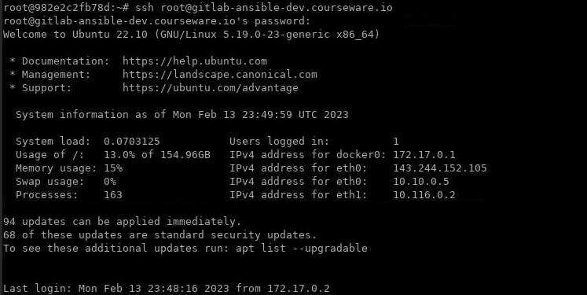
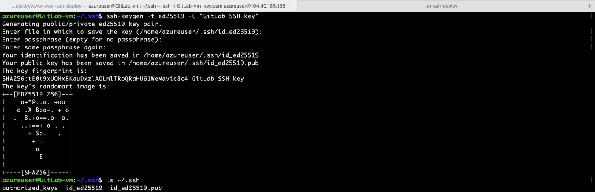
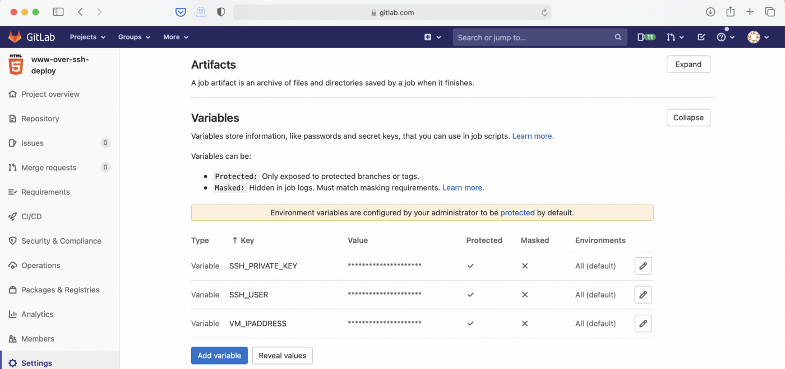
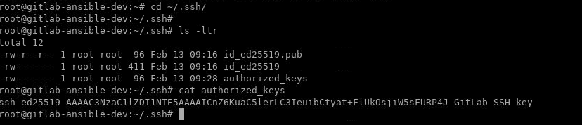
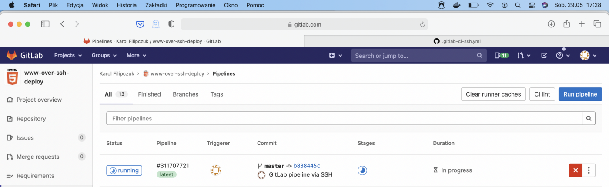
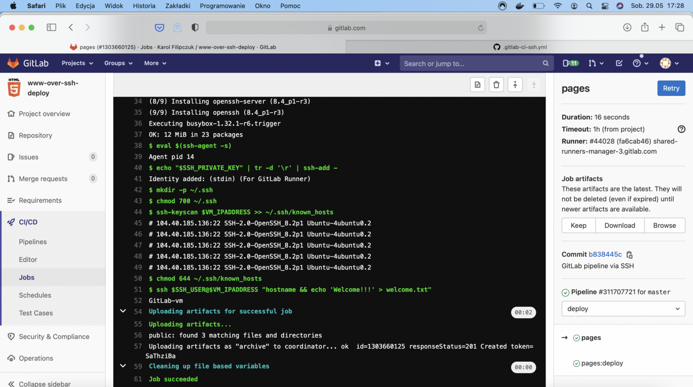
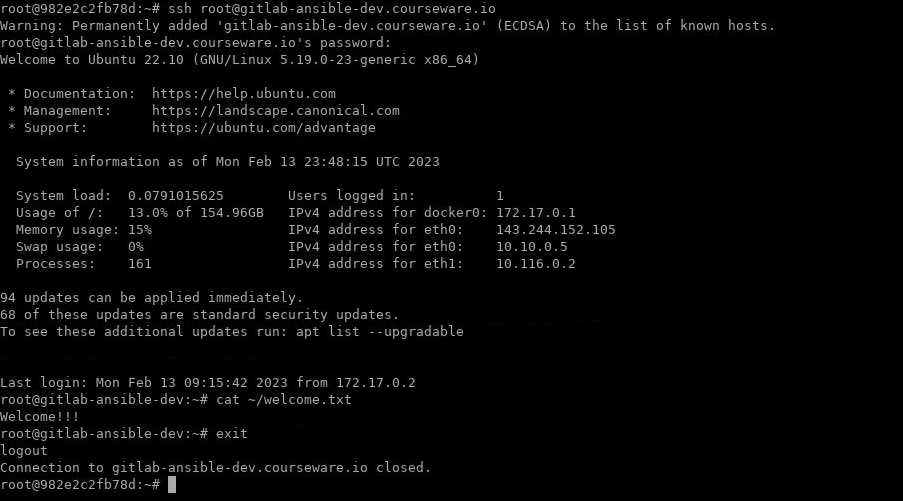

# GitLab CI Pipeline. Deployment via SSH to Remote Server

When you think about deploying to remote server, SSH is first network
protocol which comes to your mind. Adding on top GitLab CI/CD will let
you take advantage of automation. To use GitLab CI/CD pipeline together
with SSH connections it is necessary to firstly configure GitLab and I
would like to show you how to configure it and run simple script.

# Prerequisite

-   GitLab account
-   Remote server

# Agenda

1.  Create new GitLab project
2.  Create and add SSH keys
3.  Create and run GitLab CI/CD pipeline

# Create new GitLab project

As a first step we will create GitLab project.
Login into GitLab and navigate to
`New project -> Create from template -> Pages/Plain HTML -> Use template`. Give it a project name and hit
`Create project`. This will
create a simple plain html project.


Pages/Plain HTML project

The template cretaed README.md file, initial
`.gitlab-ci.yml` and public
directory with `index.html` and
`style.css` files.

# Create and add SSH keys

We already have an example project, now we need to create SSH keys. They
will be used to connect to our remote server. Each time GitLab CI/CD
pipeline is running, it is using GitLab Runner.

You can create new SSH key in any environment, even your local
environment. When you create new SSH key, you will receive two keys:
private and public. It is important that GitLab have private key and
your remote server has public key. That is why it doesn't matter where
you create keys, it only matters to share them accordingly with GitLab
and remote server.

GitLab recommendation is to create SSH key type ED25519, which is more secure than RSA. 

**NOTE:** Make sure to open new terminal and connect with your remote VM as shown below before creating SSH keys:

`ssh root@YOUR_VM_DNS_NAME.courseware.io`




**Password:** Will be provided by Instructor.

1. To create new key run `ssh-keygen -t ed25519 -C "GitLab SSH key"` in the same **terminal**. Text after `-C` option is a comment and you can change it.

2. Press `Enter`. Output similar to the following is displayed:

    ```
    Generating public/private ed25519 key pair.
    Enter file in which to save the key (~/.ssh/id_ed25519):
    ```

3. Accept the suggested filename and directory.

4. Do not specify a passphrase:

    ```
    Enter passphrase (empty for no passphrase):
    Enter same passphrase again:
    ```



The key will be created in default directory which for linux is
`~/.ssh`. Do not
specify passphrase, otherwise it will be cumbersome for GitLab CI/CD
pipeline. You should have two new files in `.ssh` directory:

-   `id_ed25519` --- private key
-   `id_ed25519.pub` --- public
    key

## Add private key as GitLab Variable

Copy content of private key and go back to GitLab project. Navigate to
`Settings -> CI/CD -> Variables -> Expand -> Add Variable`. GitLab's variable is a key-value pair. Name key
`SSH_PRIVATE_KEY` and paste
private key in value field. Click `Add Variable`.

Add two more variables:

-   `SSH_USER` --- name of the
    user on the remote server
-   `VM_IPADDRESS` --- IP address of remote server i-e: **YOUR_VM_DNS_NAME.courseware.io**




## Add public key to remote server

Copy content of public key and go back to remote server. Login as the
same user which you have specified in `SSH_USER` GitLab's variable. If you don't have yet this user,
it is time to create it.

Navigate to `~/.ssh`. If directory `.ssh` doesn't exist, then create it. Paste the public key
into `authorized_keys` file. If
you don't have `authorized_keys`
file, create it. Here is screenshot from the VM.




# Create and run GitLab CI/CD pipeline

It's time to create GitLab CI/CD pipeline. We want to achieve two goals
using SSH: log remote server's hostname and create an example file in
user's home directory.

The pipeline is defined in `.gitlab-ci.yml` and we have two option to create/edit:

1.  Directly in GitLab project in web browser, we can edit
    `.gitlab-ci.yml` and commit
    changes
2.  Clone repository, edit `.gitlab-ci.yml` in your favorite code editor, commit changes and
    push it to GitLab

Let's go with option number 2, it's more proper way to handle `.gitlab-ci.yml`.

You can clone repository using command
`git clone <repo_address>` and
repo address you can find in GitLab repository by clicking
`Clone` button.
After cloning open already existing `.gitlab-ci.yml` which was created as part of the Pages/Plain HTML template.


```
image: alpine:latest

pages:
  stage: deploy
  script:
  - echo 'Nothing to do...'
  artifacts:
    paths:
    - public
  only:
  - main
```


We need to add `before_script` section and update `script` section.


```
image: alpine:latest

pages:
  stage: deploy
  before_script:
  - 'command -v ssh-agent >/dev/null || ( apk add --update openssh )' 
  - eval $(ssh-agent -s)
  - echo "$SSH_PRIVATE_KEY" | tr -d '\r' | ssh-add -
  - mkdir -p ~/.ssh
  - chmod 700 ~/.ssh
  - ssh-keyscan $VM_IPADDRESS >> ~/.ssh/known_hosts
  - chmod 644 ~/.ssh/known_hosts
  script:
  - ssh $SSH_USER@$VM_IPADDRESS "hostname && echo 'Welcome!!!' > welcome.txt"
  artifacts:
    paths:
    - public
  only:
  - main
```

`.gitlab-ci.yml` defines
pipeline. It uses docker image `alpine:latest` to run jobs defined in pipeline. We only have one
job `pages`.

The job run in `stage: deploy`.
We didn't define any stages, but we have 5 default stages to use:
`.pre, build, test, deploy, .post`. It doesn't matter in our case, since our pipeline
at the moment is simple and doesn't require setting up stages.

Then we have `before_script`
which is pretty self-explanatory and will run before
`script` command. Let's explain
script line by line:

-   `command -v ssh-agent > /dev/null || (apk add --update openssh)` --- checks if ssh-agent is already installed and
    if not, then install it
-   `eval $(ssh-agent -v)` ---
    starts ssh-agent
-   `echo "$SSH_PRIVATE_KEY" | tr -d '\r' | ssh-add —` --- adds ssh private key stored in variable
    `SSH_PRIAVTE_KEY` to agent
    store
-   `mkdir -p ~/.ssh` and
    `chmod 700 ~/.ssh` ---
    creates `.ssh` directory and
    assign correct permissions
-   `ssh-keyscan $VM_IPADDRESS >> ~/.ssh/known_hosts` --- checks public key on remotes server using IP
    address stored in `VM_IPADDRESS` variable and add it to known hosts. It is
    protecting from men-in-the-middle attack and is necessary to work,
    otherwise the job will fail.
-   `chmod 644 ~/.ssh/known_hosts` --- assign correct permissions


`script` is where our actual
code to execute is defined. We simply want to print hostname to job log
and then create an example file on remote host.
`ssh $SSH_USER@$IP_ADDRESS "hostname && echo 'Welcome!!!' > welcome.txt"` will connect over SSH as user specified in
`SSH_USER` variable to remote
server, then run command `hostname` which will print hostname and echo
`Welcome!!!` to file
`welcome.txt` which will be
created on remote server in `SSH_USER` home directory.

`artifacts` specify which
artifacts to use in deployment. We are not using it in our example.

`only` specify that the job
should be only run if any change is pushed into
`main` branch in repository.

After making changes, we need to commit them and push to repository.

 *Add,
commit and push changes to repository*

Once the change is pushed into main branch the GitLab CI/CD will be
trigged. Navigate to `CI/CD -> Pipelines` and you should see pipeline in status running.



Running pipeline

Click on it and the click on job `pages` to see logs.



Pipeline\'s job logs

Job should finish quickly, in my case it took 16 seconds. The last line
shows that job was run successfully. Line 51 shows
`script` part from
`.gitlab-ci.yml` and in line 52
we can see remote server hostname which is exactly what we wanted to
achieve. Check your remote server, you will find
`welcome.txt` there.

**NOTE: Make sure to run following command in terminal where you have connected with remote server using SSH.**



That's it! We have successfully created new GitLab project, setup SSH
connection to remote server and created simple GitLab CI/CD pipeline to
run script via SSH to the remote server.
