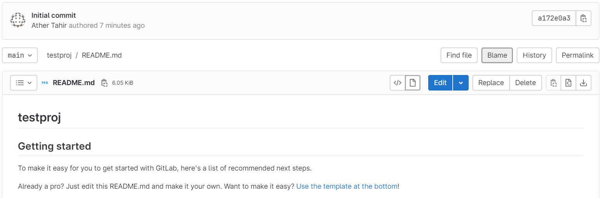

Quickstart for writing on Gitlab
================================

In this lab, we will cover following topics:

- Adding a table
- Adding a collapsed section
- Adding a quote
- Adding a comment
- Saving your work


Creating or editing your README
-----------------------------------------

1.  Create a repository with the,
    initializing the repository with a `README.md` file.
    
2.  Edit the `README.md` file and delete the template text that is automatically 
    added when you create the file.

2.  Click `README.md` and then click `Edit` to start editing the file.

    


Adding a table
------------------------------------------------------------

You can use Markdown tables to organize information. Here, you\'ll use a
table to introduce yourself by ranking something, such as your most-used
programming languages or frameworks, the things you\'re spending your
time learning, or your favorite hobbies. When a table column contains
numbers, it\'s useful to right-align the column by using the syntax
`--:` below the header row.

1.  Return to the **Edit file** tab.

2.  To introduce yourself, two lines below the `</picture>` tag, add an
    `## About me` header and a short paragraph about yourself, like the
    following.

        ## About me

        Hi, I'm Mona.

    
3.  Two lines below this paragraph, insert a table by copying and
    pasting the following markup.

    
```
| Rank | THING-TO-RANK |
|-----:|---------------|
|     1|               |
|     2|               |
|     3|               |
```

4.  In the column on the right, replace `THING-TO-RANK` with
    \"Languages,\" \"Hobbies,\" or anything else, and fill in the column
    with your list of things.

5.  To check the table has rendered correctly, click the **Preview**
    tab.


### Example

    ## About me

    Hi, I'm Mona.

    | Rank | Languages |
    |-----:|-----------|
    |     1| Javascript|
    |     2| Python    |
    |     3| SQL       |

### How it looks


Adding a collapsed section
---------------------------------------------------------

To keep your content tidy, you can use the `<details>` tag to create an
expandible collapsed section.

1.  To create a collapsed section for the table you created, wrap your
    table in `<details>` tags like in the following example.

    
    HTML
        <details>
        <summary>My top THINGS-TO-RANK</summary>

        YOUR TABLE

        </details>
    

2.  Between the `<summary>` tags, replace `THINGS-TO-RANK` with whatever
    you ranked in your table.

3.  Optionally, to make the section display as open by default, add the
    `open` attribute to the `<details>` tag.

        <details open>

4.  To check the collapsed section has rendered correctly, click the
    **Preview** tab.

### Example

    <details>
    <summary>My top languages</summary>

    | Rank | Languages |
    |-----:|-----------|
    |     1| Javascript|
    |     2| Python    |
    |     3| SQL       |
      
    </details>

### How it looks


Adding a quote
------------------------------------------------------------

Markdown has many other options for formatting your content. Here,
you\'ll add a horizontal rule to divide your page and a blockquote to
format your favorite quote.

1.  At the bottom of your file, two lines below the `</details>` tag,
    add a horizontal rule by typing three or more dashes.

        ---

2.  Below the `---` line, add a quote by typing markup like the
    following.

        > QUOTE

    Replace `QUOTE` with a quote of your choice. Alternatively, copy the
    quote from our example below.

3.  To check everything has rendered correctly, click the **Preview**
    tab.

### Example

    ---
    > If we pull together and commit ourselves, then we can push through anything.

    — Mona

### How it looks


Adding a comment
----------------------------------------------------------------

You can use HTML comment syntax to add a comment that will be hidden in
the output. Here, you\'ll add a comment to remind yourself to update
your README later.

1.  Two lines below the `## About me` header, insert a comment by using
    the following markup.

        <!-- COMMENT -->

    Replace `COMMENT` with a \"to-do\" item you remind yourself to do
    something later (for example, to add more items to the table).

2.  To check your comment is hidden in the output, click the **Preview**
    tab.

### Example

    ## About me

    <!-- TO DO: add more details about me later -->

Saving your work
----------------------------------------------------------------

When you\'re happy with your changes, save your profile README by
clicking **Commit changes**.

Committing directly to the `main` branch will make your changes visible
to any visitor on your profile. If you want to save your work but
aren\'t ready to make it visible on your profile, you can select
**Create a new branch for this commit and start a pull request**.


