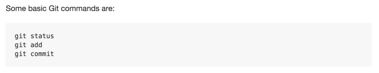
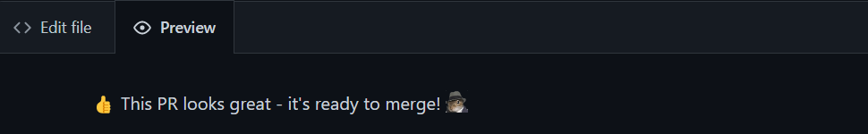

Basic writing and formatting syntax
===================================


Create sophisticated formatting for your prose and code on Gitlab with
simple syntax.


Headings
---------------------------------------------------

To create a heading, add one to six [\#] symbols before your
heading text. The number of [\#] you use will determine the size
of the heading.

    # The largest heading
    ## The second largest heading
    ###### The smallest heading


Styling text
-----------------------------------------------------------

You can indicate emphasis with bold, italic, strikethrough, subscript,
or superscript text in comment fields and `.md` files.


Quoting text
-----------------------------------------------------------

You can quote text with a [\>].

    Text that is not a quote

    > Text that is a quote


Quoting code
-----------------------------------------------------------

You can call out code or a command within a sentence with single
backticks. The text within the backticks will not be formatted. You can
also press the [Command]+[E] (Mac) or [Ctrl]+[E]
(Windows/Linux) keyboard shortcut to insert the backticks for a code
block within a line of Markdown.

    Use `git status` to list all new or modified files that haven't yet been committed.


To format code or text into its own distinct block, use triple
backticks.

    Some basic Git commands are:
    ```
    git status
    git add
    git commit
    ```



If you are frequently editing code snippets and tables, you may benefit
from enabling a fixed-width font in all comment fields on Gitlab.

Supported color models
----------------------------------------------------

In issues, pull requests, and discussions, you can call out colors
within a sentence by using backticks. A supported color model within
backticks will display a visualization of the color.

    The background color should be `#ffffff` for light mode and `#0d1117` for dark mode.


Here are the currently supported color models.


**Notes:**

-   A supported color model cannot have any leading or trailing spaces
    within the backticks.
-   The visualization of the color is only supported in issues, pull
    requests, and discussions.


Lists
---------------------------------------------

You can make an unordered list by preceding one or more lines of text
with [-], [\*], or [+].

    - George Washington
    * John Adams
    + Thomas Jefferson


To order your list, precede each line with a number.

    1. James Madison
    2. James Monroe
    3. John Quincy Adams


### Nested Lists

You can create a nested list by indenting one or more list items below
another item.

To create a nested list using the web editor on Gitlab or a text editor
that uses a monospaced font, like `Visual Studio Code`, you can align your list visually.
Type space characters in front of your nested list item, until the list
marker character ([-] or [\*]) lies directly below the first
character of the text in the item above it.

    1. First list item
       - First nested list item
         - Second nested list item


**Note**: In the web-based editor, you can indent or dedent one or more
lines of text by first highlighting the desired lines and then using
[Tab] or [Shift]+[Tab] respectively.


To create a nested list in the comment editor on Gitlab, which doesn\'t
use a monospaced font, you can look at the list item immediately above
the nested list and count the number of characters that appear before
the content of the item. Then type that number of space characters in
front of the nested list item.

In this example, you could add a nested list item under the list item
`100. First list item` by indenting the nested list item a minimum of
five spaces, since there are five characters (`100. `) before
`First list item`.

    100. First list item
         - First nested list item


You can create multiple levels of nested lists using the same method.
For example, because the first nested list item has seven characters
(`␣␣␣␣␣-␣`) before the nested list content `First nested list item`, you
would need to indent the second nested list item by seven spaces.

    100. First list item
         - First nested list item
           - Second nested list item


Task lists
-------------------------------------------------------

To create a task list, preface list items with a hyphen and space
followed by `[ ]`. To mark a task as complete, use `[x]`.

    - [x] Complete PR Review
    - [ ] Add delight to the experience when all tasks are complete :tada:

Using emoji
---------------------------------------------------------

You can add emoji to your writing by typing `:EMOJICODE:`.

`:+1: This PR looks great - it's ready to merge!`



Typing [:] will bring up a list of suggested emoji. The list will
filter as you type, so once you find the emoji you\'re looking for,
press **Tab** or **Enter** to complete the highlighted result.

Paragraphs
-------------------------------------------------------

You can create a new paragraph by leaving a blank line between lines of
text.

Footnotes
-----------------------------------------------------

You can add footnotes to your content by using this bracket syntax:

    Here is a simple footnote[^1].

    A footnote can also have multiple lines[^2].  

    You can also use words, to fit your writing style more closely[^note].

    [^1]: My reference.
    [^2]: Every new line should be prefixed with 2 spaces.  
      This allows you to have a footnote with multiple lines.
    [^note]:
        Named footnotes will still render with numbers instead of the text but allow easier identification and linking.  
        This footnote also has been made with a different syntax using 4 spaces for new lines.

The footnote will render like this:


**Note**: The position of a footnote in your Markdown does not influence
where the footnote will be rendered. You can write a footnote right
after your reference to the footnote, and the footnote will still render
at the bottom of the Markdown.

Footnotes are not supported in wikis.


Hiding content with comments
----------------------------------------------------------------

You can tell Gitlab to hide content from the rendered Markdown by
placing the content in an HTML comment.

    <!-- This content will not appear in the rendered Markdown -->

Ignoring Markdown formatting
----------------------------------------------------------------

You can tell Gitlab to ignore (or escape) Markdown formatting by using
[\\] before the Markdown character.

`Let's rename \*our-new-project\* to \*our-old-project\*.`


