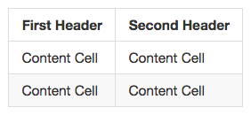
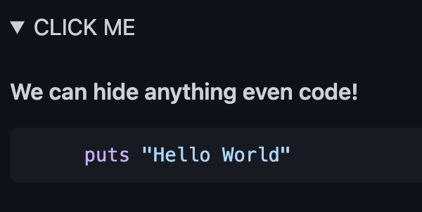

Lab: Advanced Gitlab Formatting
================================


Creating a table
------------------

**Note:** Create a Gitlab repository or create README.md in the exisitng repository before starting the lab.


You can create tables with pipes `|` and hyphens `-`. Hyphens are used
to create each column\'s header, while pipes separate each column. You
must include a blank line before your table in order for it to correctly
render.

    | First Header  | Second Header |
    | ------------- | ------------- |
    | Content Cell  | Content Cell  |
    | Content Cell  | Content Cell  |



The pipes on either end of the table are optional.

Cells can vary in width and do not need to be perfectly aligned within
columns. There must be at least three hyphens in each column of the
header row.

    | Command | Description |
    | --- | --- |
    | git status | List all new or modified files |
    | git diff | Show file differences that haven't been staged |


If you are frequently editing code snippets and tables, you may benefit
from enabling a fixed-width font in all comment fields on Gitlab.

Formatting content within your table
----------------------------------------------------------

You can use
[formatting]
such as links, inline code blocks, and text styling within your table:

    | Command | Description |
    | --- | --- |
    | `git status` | List all *new or modified* files |
    | `git diff` | Show file differences that **haven't been** staged |


You can align text to the left, right, or center of a column by
including colons `:` to the left, right, or on both sides of the hyphens
within the header row.

    | Left-aligned | Center-aligned | Right-aligned |
    | :---         |     :---:      |          ---: |
    | git status   | git status     | git status    |
    | git diff     | git diff       | git diff      |


To include a pipe `|` as content within your cell, use a `\` before the
pipe:

    | Name     | Character |
    | ---      | ---       |
    | Backtick | `         |
    | Pipe     | \|        |


Organizing information with collapsed sections
==============================================


You can streamline your Markdown by creating a collapsed section with
the `<details>` tag.


Creating a collapsed section
------------------------------------------------------

You can temporarily obscure sections of your Markdown by creating a
collapsed section that the reader can choose to expand. For example,
when you want to include technical details in an issue comment that may
not be relevant or interesting to every reader, you can put those
details in a collapsed section.

Any Markdown within the `<details>` block will be collapsed until the
reader clicks to expand the details. Within the `<details>` block, use
the `<summary>` tag to create a label to the right of .

````
<details><summary>CLICK ME</summary>
<p>

#### We can hide anything, even code!

```ruby
    puts "Hello World"
```

</p>
</details>
````


The Markdown will be collapsed by default.


After a reader clicks , the details are expanded.




Creating and highlighting code blocks
=====================================


Share samples of code with fenced code blocks and enabling syntax
highlighting.


Fenced code blocks
----------------------------------------------------

You can create fenced code blocks by placing triple backticks
```` ``` ```` before and after the code block. We recommend placing a
blank line before and after code blocks to make the raw formatting
easier to read.

    ```
    function test() {
      console.log("notice the blank line before this function?");
    }
    ```


**Tip:** To preserve your formatting within a list, make sure to indent
non-fenced code blocks by eight spaces.


To display triple backticks in a fenced code block, wrap them inside
quadruple backticks.

    ````
    ```
    Look! You can see my backticks.
    ```
    ````


If you are frequently editing code snippets and tables, you may benefit
from enabling a fixed-width font in all comment fields on Gitlab.


Syntax highlighting
------------------------------------------------------

You can add an optional language identifier to enable syntax
highlighting in your fenced code block.

For example, to syntax highlight Ruby code:

    ```ruby
    require 'redcarpet'
    markdown = Redcarpet.new("Hello World!")
    puts markdown.to_html
    ```


