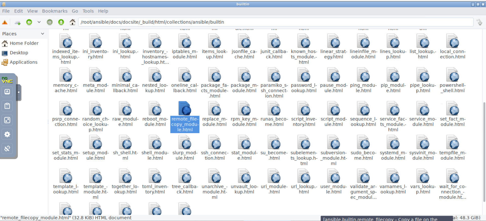
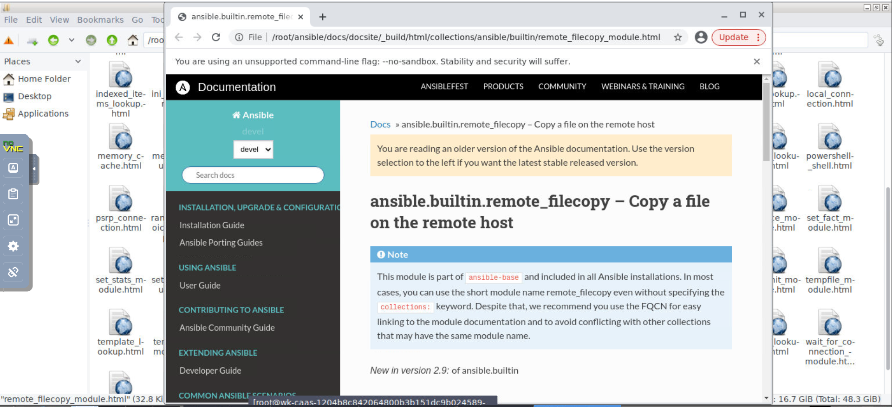

Lab 17. Consuming and Creating Modules
======================================


Specifically, in this lab, you will cover the following topics:

-   Executing multiple modules using the command line
-   Reviewing the module index
-   Accessing module documentation from the command line
-   Module return values
-   Developing custom modules

Let\'s get started!


#### Lab Environment

All lab file are present at below path. Run following command in the terminal first before running commands in the lab:

`cd ~/Desktop/gitlab-ci-ansible-course/Lab_17` 


Executing multiple modules using the command line
=================================================

As this lab is all about modules and how to create them, let\'s
recap how to use modules. We\'ve done this throughout this course, but we
have not drawn attention to some of the specifics related to how they
work. One of the key things we have not discussed is how the Ansible
engine talks to its modules and vice versa, so let\'s explore this now.

As ever, when working with Ansible commands, we need an inventory to run
our commands against. For this lab, as our focus is on the modules
themselves, we will use a very simple and small inventory, as shown
here:

```
[frontends]
frt01.example.com

[appservers]
app01.example.com
```

<span style="color:red;">Note: Check `/root/hosts` file and add above host information (because `-i hosts` path is specified so ansible will look in `~/hosts` file)</span>

Now, for the first part of our recap, you can run a module very easily
via an ad hoc command and use the [-m] switch to tell Ansible
which module you want to run. Hence, one of the simplest commands you
can run is the Ansible [ping] command, as shown here:

```
ansible -i hosts appservers -m ping
```

Now, one thing we have not previously looked at is the communication
between Ansible and its modules; however, let\'s examine the output of
the preceding command:


```
ansible -i hosts appservers -m ping

app01.example.com | SUCCESS => {
    "ansible_facts": {
        "discovered_interpreter_python": "/usr/bin/python3"
    },
    "changed": false,
    "ping": "pong"
}
```


Did you notice the structure of the output -- the curly braces, colons,
and commas? Yes, Ansible uses JSON-formatted data to talk to its
modules, and the modules report their data back to Ansible in JSON as
well. The preceding output is, in fact, a subset of the JSON-formatted
data returned to the Ansible engine by the [ping] module.


Now, let\'s run another command that takes an argument and passes that
data to the module:

```
ansible -i hosts appservers -m command -a "/bin/echo 'hello modules'"
```

In this case, we provided a single string as an argument to the command
module, which Ansible, in turn, converts into JSON and passes down to
the command module when it\'s invoked. When you run this ad hoc command,
you will see an output similar to the following:


```
 ansible -i hosts appservers -m command -a "/bin/echo 'hello modules'"

app01.example.com | CHANGED | rc=0 >>
hello modules
```


Accessing module documentation from the command line
====================================================


The following are some examples to show you how to interact with the
[ansible-doc] tool:

-   You can list all of the modules that there\'s documentation for on
    your Ansible control machine by simply issuing the following
    command:

```
ansible-doc -l
```

You should see an output similar to the following:

```
a10_server                                                    Manage A10 Ne...
a10_server_axapi3                                             Manage A10 Ne...
a10_service_group                                             Manage A10 Ne...
a10_virtual_server                                            Manage A10 Ne...
aci_aaa_user                                                  Manage AAA us...
aci_aaa_user_certificate                                      Manage AAA us...
aci_access_port_block_to_access_port                          Manage port b...
aci_access_port_to_interface_policy_leaf_profile              Manage Fabric...
aci_access_sub_port_block_to_access_port                      Manage sub po...
aci_aep                                                       Manage attach...
aci_aep_to_domain                                             Bind AEPs to ...
aci_ap                                                        Manage top le...
aci_bd                                                        Manage Bridge...
aci_bd_subnet                                                 Manage Subnet...
...
```

There are many pages of output, which just shows you how many modules
there are! In fact, you can count them:

```
ansible-doc -l | wc -l

3387
```

That\'s right -- 3,387 modules ship with Ansible 2.9

-   As before, you can search for specific modules using your favorite
    shell tools to process the index; for example, you could
    [grep] for [ping] to find all of the ping-related modules,
    as we did interactively in the web browser in the previous section:

```
ansible-doc -l | grep ping


fortios_firewall_shaping_policy                               Configure sha...
fortios_firewall_shaping_profile                              Configure sha...
fortios_switch_controller_igmp_snooping                       Configure For...
icx_ping                                                      Tests reachab...
ios_ping                                                      Tests reachab...
junos_ping                                                    Tests reachab...
net_ping                                                      Tests reachab...
netapp_e_lun_mapping                                          NetApp E-Seri...
nxos_igmp_snooping                                            Manages IGMP ...
nxos_ping                                                     Tests reachab...
ping                                                          Try to connec...
pingdom                                                       Pause/unpause...
pn_igmp_snooping                                              CLI command t...
postgresql_ping                                               Check remote ...
vyos_ping                                                     Tests reachab...
win_ping                                                      A windows ver...
```


-   Now, we can easily look up the specific documentation for the module
    that interests us. Say we want to learn more about the
    [ping] module -- just as we did on the website, simply run
    the following:


```
ansible-doc ping
```

This should produce an output similar to the following:

```
ansible-doc ping


> PING    (/usr/lib/python3/dist-packages/ansible/modules/system/ping.py)

        A trivial test module, this module always returns `pong' on
        successful contact. It does not make sense in playbooks, but
        it is useful from `/usr/bin/ansible' to verify the ability to
        login and that a usable Python is configured. This is NOT ICMP
        ping, this is just a trivial test module that requires Python
        on the remote-node. For Windows targets, use the [win_ping]
        module instead. For Network targets, use the [net_ping] module
        instead.

  * This module is maintained by The Ansible Core Team
OPTIONS (= is mandatory):

- data
        Data to return for the `ping' return value.
        If this parameter is set to `crash', the module will cause an
        exception.
        [Default: pong]
        type: str

```


Module return values
====================

Let\'s use the [ansible-doc] tool that we
learned about in the previous section and see what this says about the
return values for this module:


```
ansible-doc ping
```

If you scroll to the bottom of the output from the preceding command,
you should see something like this:

```
ansible-doc ping


...

RETURN VALUES:

ping:
    description: value provided with the data parameter
    returned: success
    type: str
    sample: pong
```


Ping module will only return one
value, and that is called [ping]. [description] tells us
what we should expect this particular return value to contain, while the
[returned] field tells us that it will only be returned on
[success]. The [type] return value is a string
(denoted by [str]), and although you can change the value with an
argument provided to the [ping] module, the default return value
(and hence [sample]) is [pong].


Let\'s put a very simple playbook together. We\'re going to run the
[ping] module with no arguments, capture the return values using
the [register] keyword, and then use the [debug] module to
dump the return values onto the Terminal:


```
---
- name: Simple play to demonstrate a return value
  hosts: localhost

  tasks:
    - name: Perform a simple module based task
      ping:
      register: pingresult

    - name: Display the result
      debug:
        var: pingresult
```

Now, let\'s see what happens when we run this playbook:

```
ansible-playbook retval.yml


PLAY [Simple play to demonstrate a return value] *******************************

TASK [Gathering Facts] *********************************************************
ok: [localhost]

TASK [Perform a simple module based task] **************************************
ok: [localhost]

TASK [Display the result] ******************************************************
ok: [localhost] => {
    "pingresult": {
        "changed": false,
        "failed": false,
        "ping": "pong"
    }
}

PLAY RECAP *********************************************************************
localhost : ok=3 changed=0 unreachable=0 failed=0 skipped=0 rescued=0 ignored=0
```

Notice that the [ping] module does indeed return a value called
[ping], which contains the [pong] string (as the ping was
successful). However, you can see that there are, in fact, two
additional return values that were not listed in the Ansible
documentation. These accompany every single task run, and are hence
implicit -- that is to say, you can assume they will be among the data
that\'s returned from every module. The [changed] return value
will be set to [true] if the module run resulted in a change on
the target host, while the [failed] return value will be set to
[true] if the module run failed for some reason.


Developing custom modules
=========================


One important point to note is that Ansible is written in Python, and as
such, so are its modules. As a result, you will need to write your
module in Python:


-   On Ubuntu, you would run the following commands to install the
    packages you need:

```
sudo add-apt-repository universe
sudo apt-get install python3-pip
```


Once you have the required packages installed, you will need to clone
the Ansible Git repository to your local machine as there are some
valuable scripts in there that we will need later on in the module
development process. Use the following command to clone the Ansible
repository to your current directory on your development machine:

```
cd ~ && git clone https://github.com/ansible/ansible.git
cd ansible
python -m virtualenv moduledev
```

With our development environment set up, let\'s start writing our first
module. We will code something that can use a
function from a Python library to copy a file locally on the target
machine. Now, let\'s start coding our first module:


**Note:** Complete solution/file is present in: `cd ~/Desktop/gitlab-ci-ansible-course/Lab_17` 

1.  Using vscode / vi editor, create a new file called (for example) [remote\_filecopy.py]:

```
vi remote_filecopy.py
```

2.  Start with a shebang to indicate that this module should be executed
    with Python:

```
#!/usr/bin/python
```

3.  Although not mandatory, it is good practice to add copyright
    information, as well as your details, in the headers of your new
    module. By doing this, anyone using it will understand the terms
    under which they can use, modify, or redistribute it. The text given
    here is merely an example; you should investigate the various
    appropriate licenses for yourself and determine which is the best
    for your module:

```
# Copyright: (c) 2021, Fenago <ansible@fenago.org>
# GNU General Public License v3.0+ (see COPYING or https://www.gnu.org/licenses/gpl-3.0.txt)
```

4.  It is also good practice to add an Ansible metadata section that
    includes [metadata\_version], [status],
    and [supported\_by] information immediately after the
    copyright section:

```
ANSIBLE_METADATA = {'metadata_version': '1.1',
                    'status': ['preview'],
                    'supported_by': 'community'}
```

5.  Remember [ansible-doc] and that excellent documentation that
    is available on the Ansible documentation website? That all gets
    automatically generated from special sections you add to this file.
    Let\'s get started by adding the following code to our module:

```
DOCUMENTATION = '''
---
module: remote_filecopy
version_added: "2.9"
short_description: Copy a file on the remote host
description:
  - The remote_copy module copies a file on the remote host from a given source to a provided destination.
options:
  source:
    description:
      - Path to a file on the source file on the remote host
    required: True
  dest:
    description:
      - Path to the destination on the remote host for the copy
    required: True
author:
- Fenago (@fenago)
'''
```

Pay particular attention to the [author] dictionary -- to pass the
syntax checks for inclusion in the official Ansible codebase, the
author\'s name should be appended with their GitHub ID in brackets. If
you don\'t do this, your module will still work, but it won\'t pass the
test we\'ll perform later.


6.  The examples that you will find in the documentation are also
    generated from this file -- they have their own special
    documentation section immediately after [DOCUMENTATION] and
    should provide practical examples on how you might create a task
    using your module, as shown in the following example:

```
EXAMPLES = '''
   # Example from Ansible Playbooks
   - name: backup a config file
     remote_copy:
       source: /etc/herp/derp.conf
       dest: /root/herp-derp.conf.bak
'''
```

7.  The data that\'s returned by your module to Ansible should also be
    documented in its own section. Our example module will return the
    following values:

```
RETURN = '''
source:
  description: source file used for the copy
  returned: success
  type: str
  sample: "/path/to/file.name"
dest:
  description: destination of the copy
  returned: success
  type: str
  sample: "/path/to/destination.file"
gid:
  description: group ID of destination target
  returned: success
  type: int
  sample: 502
group:
  description: group name of destination target
  returned: success
  type: str
  sample: "users"
uid:
  description: owner ID of destination target
  returned: success
  type: int
  sample: 502
owner:
  description: owner name of destination target
  returned: success
  type: str
  sample: "fred"
mode:
  description: permissions of the destination target
  returned: success
  type: int
  sample: 0644
size:
  description: size of destination target
  returned: success
  type: int
  sample: 20
state:
  description: state of destination target
  returned: success
  type: str
  sample: "file"
'''
```

8.  Immediately after we have finished our documentation section, we
    should import any Python modules we\'re going to use. Here, we will
    include the [shutil] module, which will be used to perform our
    file copy:

```
import shutil
```

9.  Now that we\'ve built up the module headers and documentation, we
    can actually start working on the code. Now, you can see just how
    much effort goes into the documentation of every single Ansible
    module! Our module should start by defining a [main] function,
    in which we will create an object of
    the [AnsibleModule] type and use an [argument\_spec]
    dictionary to obtain the options that the module was called with:


```
 def main():
       module = AnsibleModule(
           argument_spec = dict(
               source=dict(required=True, type='str'),
               dest=dict(required=True, type='str')
           ) 
       )
```


10. At this stage, we have everything we need to write our module\'s
    functional code -- even the options that it was called with. Hence,
    we can use the Python [shutil] module to perform the local
    file copy, based on the arguments provided:

```
       shutil.copy(module.params['source'],
                   module.params['dest'])
```

11. Let's  write some conditional
    logic to detect whether the module was successful and whether it
    actually performed a change on the target host or not. However, for
    simplicity, we\'ll simply exit with the [changed] status every
    time -- expanding this logic and making the return status more
    meaningful is left as an exercise for you:

```
      module.exit_json(changed=True)
```

The [module.exit\_json] method comes from [AnsibleModule],
which we created earlier -- remember, we said it was important to know
that data was passed back and forth using JSON!

12. As we approach the end of our module code, we must now tell Python
    where it can import the [AnsibleModule] object from. This can
    be done with the following line of code:

```
   from ansible.module_utils.basic import *
```

13. Now for the final two lines of code for the module -- this is where
    we tell the module that it should be running the [main]
    function when it starts:

```
   if __name__ == '__main__':
       main()
```

That\'s it -- with a series of well-documented steps, you can write your
own Ansible modules in Python. The next step is, of course, to test it,
and before we actually test it in Ansible, let\'s see whether we can run
it manually in the shell. Of course, to make the module think it is
being run within Ansible, we must generate some arguments in -- you
guessed it -- JSON format. Create a file with the following contents to
provide the arguments:

```
{
    "ANSIBLE_MODULE_ARGS": {
        "source": "/tmp/foo",
        "dest": "/tmp/bar"
    }
}
```

Armed with this little snippet of JSON, you can execute your module
directly with Python. If you haven\'t already done so, you\'ll need to
set up your Ansible development environment as follows. Note that we
also manually create the source file, [/tmp/foo], so that our
module can really perform the file copy:


```
touch /tmp/foo
. moduledev/bin/activate
. hacking/env-setup
```

### Note

Copy solution file as show below:

```
cp ~/Desktop/gitlab-ci-ansible-course/Lab_17/remote_filecopy.py ~/ansible/moduledev
cp ~/Desktop/gitlab-ci-ansible-course/Lab_17/args.json ~/ansible/moduledev
```

Now, you\'re finally ready to run your module for the first time. You
can do this as follows: 


```
(moduledev) $ python remote_filecopy.py args.json


{"changed": true, "invocation": {"module_args": {"source": "/tmp/foo", "dest": "/tmp/bar"}}}

(moduledev) $ ls -l /tmp/bar
-rw-r--r-- 1 root root 0 Apr 16 16:24 /tmp/bar
```


Avoiding common pitfalls
------------------------


If we remove the source file that we\'re attempting to
copy and then rerun our module with the same arguments, I think you\'ll
agree that the output is neither pretty nor meaningful, unless you
happen to be a hardened Python developer:

```
(moduledev) $ rm -f /tmp/foo
(moduledev) $ python remote_filecopy.py args.json

Traceback (most recent call last):
  File "remote_filecopy.py", line 99, in <module>
    main()
  File "remote_filecopy.py", line 93, in main
    module.params['dest'])
  File "/usr/lib64/python2.7/shutil.py", line 119, in copy
    copyfile(src, dst)
  File "/usr/lib64/python2.7/shutil.py", line 82, in copyfile
    with open(src, 'rb') as fsrc:
IOError: [Errno 2] No such file or directory: '/tmp/foo'
```

We can, without a doubt, do better. Let\'s make a copy of our module and
add a little code to it. First of all, replace the [shutil.copy]
lines of code with the following:

```
    try:
       shutil.copy(module.params['source'], module.params['dest'])
    except:
       module.fail_json(msg="Failed to copy file")
```


### Note

Copy solution file as show below:

`cp ~/Desktop/gitlab-ci-ansible-course/Lab_17/better_remote_filecopy.py ~/ansible/moduledev`


Now, when we try and run the module with a non-existent source file, we
will see the following cleanly formatted JSON output:

```
(moduledev) $ rm -f /tmp/foo
(moduledev) $ python better_remote_filecopy.py args.json

{"msg": "Failed to copy file", "failed": true, "invocation": {"module_args": {"dest": "/tmp/bar", "source": "/tmp/foo"}}}
```

However, the module still works in the same manner as before if the copy
succeeds:

```
(moduledev) $ touch /tmp/foo
(moduledev) $ python better_remote_filecopy.py args.json

{"invocation": {"module_args": {"dest": "/tmp/bar", "source": "/tmp/foo"}}, "changed": true}
```

With this simple change to our code, we can now cleanly and gracefully
handle the failure of the file copy operation and report something more
meaningful back to the user rather than using a traceback.


Testing and documenting your module
-----------------------------------


Let\'s get started:

1.  To run the sanity tests, assuming you have cloned the official
    repository, change into this directory and set up your environment.
    Note that if your standard Python binary isn\'t Python 3, the
    [ansible-test] tool will not run, so you should ensure Python
    3 is installed and, if necessary, set up a virtual environment to
    ensure you are using Python 3. This can be done as follows:

**Close all terminals and open new terminal**

```
cd ~/ansible
python3 -m venv venv
. venv/bin/activate

(venv) $ source hacking/env-setup

```


3.  Now, provided you have copied your module code into the appropriate
    location in the source tree (an example copy command is shown here),
    you can run the sanity tests as follows:

```
(venv) $ cp ~/ansible/moduledev/better_remote_filecopy.py ./lib/ansible/modules/
(venv) $ ansible-test sanity --requirements --test validate-modules better_remote_filecopy.py


Running sanity test 'validate-modules' with Python 3.8
```


Now that we have passed the sanity checks with [ansible-test],
let\'s see whether the documentation looks right by using the
[ansible-doc] command. This is very easy to do. First of all, exit
your virtual environment, if you are still in it, and change to the
Ansible source code directory you cloned from GitHub earlier. Now, you
can manually tell [ansible-doc] where to look for modules instead
of the default path. This means that you could run the following:

```
cd ~/ansible
ansible-doc -M moduledev/ remote_filecopy
```

You should be presented with the textual rendering of the documentation
we created earlier -- an example of the first page is shown here to give
you an idea of how it should look:

```
> REMOTE_FILECOPY (/root/ansible/moduledev/remote_filecopy.py)

        The remote_copy module copies a file on the remote host from a
        given source to a provided destination.

  * This module is maintained by The Ansible Community
OPTIONS (= is mandatory):

= dest
        Path to the destination on the remote host for the copy


= source
        Path to a file on the source file on the remote host
```

Excellent! So, we can already access our module documentation using
[ansible-doc] and indeed confirm that it renders correctly in text
mode. However, how do we go about building the HTML version?
Fortunately, there is a well-defined process for this, which we shall
outline here:

1.  Under [lib/ansible/modules/], you will find a series of
    categorized directories that modules are placed under -- ours fits
    best under the [files] category, so copy it to this location
    in preparation for the build process to come:

```
cp moduledev/remote_filecopy.py lib/ansible/modules/
```

2.  Change to the [docs/docsite/] directory as the next step in
    the documentation creation process:

```
cd docs/docsite/
```

3.  Build a documentation-based Python file. Use the following command
    to do so:

```
pip3 install -r requirements.txt 
MODULES=hello_module make webdocs
```


With this in place, you will be able to successfully run [make webdocs] to build your documentation. You will see pages of
output. A successful run should end with something like the output shown
here:

```
...
...
copying images... [100%] dev_guide/style_guide/images/thenvsthan.jpg                                                                                                                          
copying downloadable files... [100%] network/getting_started/sample_files/first_playbook_ext.yml                                                                                              
copying static files... done
copying extra files... done
dumping search index in English (code: en) ... done
dumping object inventory... done
build succeeded, 205 warnings.

The HTML pages are in _build/html.
make[1]: Leaving directory '/root/ansible/docs/docsite'

```

Now, notice how, at the end of this process, the [make] command
tells us where to look for the compiled documentation. If you look in
here, you will find the following:

```
find /root/ansible/docs/docsite -name *remote_filecopy*

/root/ansible/docs/docsite/rst/modules/better_remote_filecopy_module.rst
/root/ansible/docs/docsite/_build/html/modules/better_remote_filecopy_module.html
/root/ansible/docs/docsite/_build/doctrees/modules/better_remote_filecopy_module.doctree
```

**Note**: It will take quite some time to build complete documentation by running above command. Expected output:






Try opening up the HTML file in your web browser -- you should see that
the page renders just like one of the documentation pages from the
official Ansible project documentation! This enables you to check that
your documentation builds correctly and looks and reads well in the
context that it will be viewed in.


### Ansible module in a Playbook!

Close all terminals and open new terminal. Complete solution: `~/Desktop/gitlab-ci-ansible-course/Lab_17/testplaybook`

It is easy to run our Ansible module in a
playbook! By default, Ansible will check the playbook directory for a
subdirectory called [library/] and will run referenced modules
from here. Hence, we might create the following:

```
cd ~
mkdir testplaybook
cd testplaybook
mkdir library
cp ~/ansible/moduledev/remote_filecopy.py library/
```

Now, create a simple inventory file in this playbook directory, just as
we did previously, and add a playbook with the following contents:

```
---
- name: Playbook to test custom module
  hosts: all

  tasks:
    - name: Test the custom module
      remote_filecopy:
        source: /tmp/foo
        dest: /tmp/bar
      register: testresult

    - name: Print the test result data
      debug:
        var: testresult
```

For the purposes of clarity, your final directory structure should look
like this:

```
testplaybook
├── hosts
├── library
│   └── remote_filecopy.py
└── testplaybook.yml
```

Now, try running the playbook in the usual manner and see what happens:

```
cd ~/Desktop/gitlab-ci-ansible-course/Lab_17/testplaybook
ansible-playbook -i hosts testplaybook.yml


PLAY [Playbook to test custom module] ******************************************

TASK [Gathering Facts] *********************************************************
ok: [frt01.example.com]
ok: [app01.example.com]

TASK [Test the custom module] **************************************************
changed: [app01.example.com]
changed: [frt01.example.com]

TASK [Print the test result data] **********************************************
ok: [app01.example.com] => {
    "testresult": {
        "changed": true,
        "failed": false
    }
}
ok: [frt01.example.com] => {
    "testresult": {
        "changed": true,
        "failed": false
    }
}

PLAY RECAP *********************************************************************
app01.example.com : ok=3 changed=1 unreachable=0 failed=0 skipped=0 rescued=0 ignored=0
frt01.example.com : ok=3 changed=1 unreachable=0 failed=0 skipped=0 rescued=0 ignored=0
```

Success! Not only have you tested your Python code locally, but you have
also successfully run it on two remote servers in an Ansible playbook.
That was really easy, which just proves how straightforward it is to get
started expanding your Ansible modules to meet your own needs.


Summary
=======


In this lab, we started with a recap of how to execute multiple
modules using the command line. We then explored the process of
interrogating the current module index, as well as how to obtain
documentation about modules to evaluate their suitability for our needs,
regardless of whether we have an active internet connection or not. We
then explored module data and its JSON format, before finally going on a
journey through which we put together the code for a simple custom
module. This provided you with a basis for creating your own modules in
the future, if you so desire.

In the next lab, we will explore the process of using and creating
another core Ansible feature, known as plugins.


Questions
=========

1.  Which command line can be passed down as a parameter to a module?

A\) [ansible dbservers -m command \"/bin/echo \'hello modules\'\"]

B\) [ansible dbservers -m command -d \"/bin/echo \'hello
modules\'\"]

C\) [ansible dbservers -z command -a \"/bin/echo \'hello
modules\'\"]

D\) [ansible dbservers -m command -a \"/bin/echo \'hello
modules\'\"]

E\) [ansible dbservers -a \"/bin/echo \'hello modules\'\"]

2.  Which of the following practices is not recommended when you create
    a custom module and address exceptions?

A\) Design a custom module simply and never provide a traceback to the
user, if you can avoid it.

B\) Fail your module code quickly, and verify that you are providing
helpful and understandable exception messages.

C\) Only display error messages for the most relevant exceptions, rather
than all possible errors.

D\) Ensure that your module documentation is relevant and easy to
understand.

E\) Delete playbooks that result in errors and then recreate them from
scratch.

3.  True or False: To contribute to the Ansible upstream project, you
    need to submit your code to the [devel] branch. 

A\) True

B\) False


