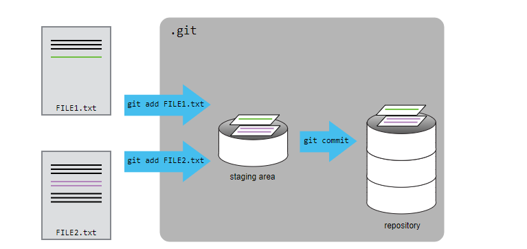

Lab: Exploring Project History
------------------------------


**Creating a Repository**

Let's create a new directory in the `work` folder for our work and then change the current
working directory to the newly created one:


``` 
$ cd ~/Desktop
$ mkdir planets
$ cd planets
```


Then we tell Git to make `planets` a [repository]-- a place where Git can store versions of our files:


``` 
$ git init
```


It is important to note that `git init` will create a repository that can include
subdirectories and their files---there is no need to create separate
repositories nested within the `planets` repository, whether subdirectories are present from
the beginning or added later. Also, note that the creation of the
`planets` directory and its
initialization as a repository are completely separate processes.

If we use `ls` to show the
directory's contents, it appears that nothing has changed:


``` 
$ ls
```


But if we add the `-a` flag to
show everything, we can see that Git has created a hidden directory
within `planets` called
`.git`:


``` 
$ ls -a
```


``` 
.  ..  .git
```


Git uses this special subdirectory to store all the information about
the project, including the tracked files and sub-directories located
within the project's directory. If we ever delete the
`.git` subdirectory, we will
lose the project's history.

Next, we will change the default branch to be called
`main`. This might be the
default branch depending on your settings and version of git.


``` 
$ git checkout -b main
```


``` 
Switched to a new branch 'main'
```


We can check that everything is set up correctly by asking Git to tell
us the status of our project:


``` 
$ git status
```


``` 
On branch main

No commits yet

nothing to commit (create/copy files and use "git add" to track)
```


#### Tracking Changes

First let's make sure we're still in the right directory. You should be in the `planets` directory.


``` 
$ cd ~/Desktop/planets
```


Let's create a file called `mars.txt` that contains some notes about the Red Planet's
suitability as a base. We'll use `nano` to edit the file.


``` 
$ nano mars.txt
```


Type the text below into the `mars.txt` file:


``` 
Cold and dry, but everything is my favorite color
```


Let's first verify that the file was properly created by running the
list command (`ls`):


``` 
$ ls
```


``` 
mars.txt
```


`mars.txt` contains a single
line, which we can see by running:


``` 
$ cat mars.txt
```


``` 
Cold and dry, but everything is my favorite color
```


If we check the status of our project again, Git tells us that it's
noticed the new file:


``` 
$ git status
```


``` 
On branch main

No commits yet

Untracked files:
   (use "git add <file>..." to include in what will be committed)

    mars.txt

nothing added to commit but untracked files present (use "git add" to track)
```


The "untracked files" message means that there's a file in the directory
that Git isn't keeping track of. We can tell Git to track a file using
`git add`:


``` 
$ git add mars.txt
```


and then check that the right thing happened:


``` 
$ git status
```


``` 
On branch main

No commits yet

Changes to be committed:
  (use "git rm --cached <file>..." to unstage)

    new file:   mars.txt
```


Git now knows that it's supposed to keep track of
`mars.txt`, but it hasn't
recorded these changes as a commit yet. To get it to do that, we need to
run one more command:


``` 
$ git commit -m "Start notes on Mars as a base"
```


``` 
[main (root-commit) f22b25e] Start notes on Mars as a base
 1 file changed, 1 insertion(+)
 create mode 100644 mars.txt
```


If we run `git status` now:


``` 
$ git status
```


``` 
On branch main
nothing to commit, working tree clean
```


it tells us everything is up to date. If we want to know what we've done
recently, we can ask Git to show us the project's history using
`git log`:


``` 
$ git log
```


``` 
commit f22b25e3233b4645dabd0d81e651fe074bd8e73b
Author: Vlad Dracula <fenago@example.com>
Date:   Thu Aug 22 09:51:46 2013 -0400

    Start notes on Mars as a base
```


`git log` lists all commits made
to a repository in reverse chronological order. The listing for each
commit includes the commit's full identifier (which starts with the same
characters as the short identifier printed by the
`git commit` command earlier),
the commit's author, when it was created, and the log message Git was
given when the commit was created.

> Where Are My Changes?
> ----------------------------------------------------------------------------------------------------------------------------
>
> If we run `ls` at this point,
> we will still see just one file called `mars.txt`
> . That's because Git saves information about files'
> history in the special `.git`
> directory mentioned earlier so that our filesystem doesn't become
> cluttered (and so that we can't accidentally edit or delete an old
> version).

Now suppose Dracula adds more information to the file. (Again, we'll
edit with `nano` and then
`cat` the file to show its
contents; you may use a different editor, and don't need to
`cat`.)


``` 
$ nano mars.txt
$ cat mars.txt
```


``` 
Cold and dry, but everything is my favorite color
The two moons may be a problem for Wolfman
```


When we run `git status` now, it
tells us that a file it already knows about has been modified:


``` 
$ git status
```


``` 
On branch main
Changes not staged for commit:
  (use "git add <file>..." to update what will be committed)
  (use "git checkout -- <file>..." to discard changes in working directory)

    modified:   mars.txt

no changes added to commit (use "git add" and/or "git commit -a")
```


The last line is the key phrase: "no changes added to commit". We have
changed this file, but we haven't told Git we will want to save those
changes (which we do with `git add`) nor have we saved them (which we do with
`git commit`). So let's do that
now. It is good practice to always review our changes before saving
them. We do this using `git diff`. This shows us the differences between the current
state of the file and the most recently saved version:


``` 
$ git diff
```


``` 
diff --git a/mars.txt b/mars.txt
index df0654a..315bf3a 100644
--- a/mars.txt
+++ b/mars.txt
@@ -1 +1,2 @@
 Cold and dry, but everything is my favorite color
+The two moons may be a problem for Wolfman
```


The output is cryptic because it is actually a series of commands for
tools like editors and `patch`
telling them how to reconstruct one file given the other. If we break it
down into pieces:

1.  The first line tells us that Git is producing output similar to the
    Unix `diff` command
    comparing the old and new versions of the file.
2.  The second line tells exactly which versions of the file Git is
    comparing; `df0654a` and
    `315bf3a` are unique
    computer-generated labels for those versions.
3.  The third and fourth lines once again show the name of the file
    being changed.
4.  The remaining lines are the most interesting, they show us the
    actual differences and the lines on which they occur. In particular,
    the `+` marker in the first
    column shows where we added a line.

After reviewing our change, it's time to commit it:


``` 
$ git commit -m "Add concerns about effects of Mars' moons on Wolfman"
```


``` 
On branch main
Changes not staged for commit:
  (use "git add <file>..." to update what will be committed)
  (use "git checkout -- <file>..." to discard changes in working directory)

    modified:   mars.txt

no changes added to commit (use "git add" and/or "git commit -a")
```


Whoops: Git won't commit because we didn't use
`git add` first. Let's fix that:


``` 
$ git add mars.txt
$ git commit -m "Add concerns about effects of Mars' moons on Wolfman"
```


``` 
[main 34961b1] Add concerns about effects of Mars' moons on Wolfman
 1 file changed, 1 insertion(+)
```


To allow for this, Git has a special *staging area* where it keeps track
of things that have been added to the current `changeset` but not yet committed.


Let's watch as our changes to a file move from our editor to the staging
area and into long-term storage. First, we'll add another line to the
file:


``` 
$ nano mars.txt
$ cat mars.txt
```


``` 
Cold and dry, but everything is my favorite color
The two moons may be a problem for Wolfman
But the Mummy will appreciate the lack of humidity
```


``` 
$ git diff
```


``` 
diff --git a/mars.txt b/mars.txt
index 315bf3a..b36abfd 100644
--- a/mars.txt
+++ b/mars.txt
@@ -1,2 +1,3 @@
 Cold and dry, but everything is my favorite color
 The two moons may be a problem for Wolfman
+But the Mummy will appreciate the lack of humidity
```


So far, so good: we've added one line to the end of the file (shown with
a `+` in the first column). Now
let's put that change in the staging area and see what
`git diff` reports:


``` 
$ git add mars.txt
$ git diff
```


There is no output: as far as Git can tell, there's no difference
between what it's been asked to save permanently and what's currently in
the directory. However, if we do this:


``` 
$ git diff --staged
```


``` 
diff --git a/mars.txt b/mars.txt
index 315bf3a..b36abfd 100644
--- a/mars.txt
+++ b/mars.txt
@@ -1,2 +1,3 @@
 Cold and dry, but everything is my favorite color
 The two moons may be a problem for Wolfman
+But the Mummy will appreciate the lack of humidity
```


it shows us the difference between the last committed change and what's
in the staging area. Let's save our changes:


``` 
$ git commit -m "Discuss concerns about Mars' climate for Mummy"
```


``` 
[main 005937f] Discuss concerns about Mars' climate for Mummy
 1 file changed, 1 insertion(+)
```


check our status:


``` 
$ git status
```


``` 
On branch main
nothing to commit, working tree clean
```


and look at the history of what we've done so far:


``` 
$ git log
```


``` 
commit 005937fbe2a98fb83f0ade869025dc2636b4dad5 (HEAD -> main)
Author: Vlad Dracula <fenago@example.com>
Date:   Thu Aug 22 10:14:07 2013 -0400

    Discuss concerns about Mars' climate for Mummy

commit 34961b159c27df3b475cfe4415d94a6d1fcd064d
Author: Vlad Dracula <fenago@example.com>
Date:   Thu Aug 22 10:07:21 2013 -0400

    Add concerns about effects of Mars' moons on Wolfman

commit f22b25e3233b4645dabd0d81e651fe074bd8e73b
Author: Vlad Dracula <fenago@example.com>
Date:   Thu Aug 22 09:51:46 2013 -0400

    Start notes on Mars as a base
```

#### Time-limiting options


If you are interested in commits created within
some date range that you\'re interested in, you can use a number of
options such as `--since` and `--until`, or
`--before` and `--after`. For example, the following
command gets the list of commits made in the last two weeks:

```
$ git log --since=2.weeks
```

#### Commit parents


Git, by default, will follow all the parents of each merge commit, when walking down the ancestry chain. To
make it follow only the first parent, you can use the aptly named
`--first-parent` option. This will show you the main line of
the history (sometimes called the trunk), assuming that you follow the
specific practices with respect to merging changes.

Compare (this example uses the very nice `--graph` option that
makes an ASCII-art diagram of the history) the following code\...

```
$ git log -5 --graph --oneline
```

with this:


```
$ git log -5 --graph --oneline --first-parent
```

Let\'s say that you want to find the starting point(s) of your project.
You can do this with the help of `--max-parents=0`, which
would give you all the root commits:

```
$ git log --max-parents=0 --oneline
```

#### Summarizing contributions
Ever wondered how many commits you've contributed to a project? Or perhaps, who is the most active developer during the last month (with respect to the number of commits)? Well, wonder no more, because this is what git shortlog is good for:

```
$ git shortlog -s -n
```

#### Viewing a revision and a file at revision
Sometimes, you might want to examine a single revision (for example, a commit suspected to be buggy, found with git bisect) in more detail, examining together changes with their description. Or perhaps, you want to examine the tag message of an annotated tag together with the commit it points to. Git provides a generic git show command for this; it can be used for any type of object.

For example, to examine the grandparent of the current version, use the following command:

```
$ git show HEAD^^
```


> Limit Log Size
> ---------------------------------------------------------------------------------------------------------------
>
> To avoid having `git log`
> cover your entire terminal screen, you can limit the number of commits
> that Git lists by using `-N`,
> where `N` is the number of
> commits that you want to view. For example, if you only want
> information from the last commit you can use:
>


> ``` 
> $ git log -1
> ```


>


> ``` 
> commit 005937fbe2a98fb83f0ade869025dc2636b4dad5 (HEAD -> main)
> Author: Vlad Dracula <fenago@example.com>
> Date:   Thu Aug 22 10:14:07 2013 -0400
>
>    Discuss concerns about Mars' climate for Mummy
> ```


>
> You can also reduce the quantity of information using the
> `--oneline` option:
>


> ``` 
> $ git log --oneline
> ```


>


> ``` 
> 005937f (HEAD -> main) Discuss concerns about Mars' climate for Mummy
> 34961b1 Add concerns about effects of Mars' moons on Wolfman
> f22b25e Start notes on Mars as a base
> ```


>
> You can also combine the `--oneline`
>  option with others. One useful combination adds
> `--graph` to display the
> commit history as a text-based graph and to indicate which commits are
> associated with the current `HEAD`
> , the current branch `main`:
>


> ``` 
> $ git log --oneline --graph
> ```


>


> ``` 
> * 005937f (HEAD -> main) Discuss concerns about Mars' climate for Mummy
> * 34961b1 Add concerns about effects of Mars' moons on Wolfman
> * f22b25e Start notes on Mars as a base
> ```


> Directories
> ---------------------------------------------------------------------------------------------------------
>
> Two important facts you should know about directories in Git.
>
> 1.  Git does not track directories on their own, only files within
>     them. Try it for yourself:
>
>     
>     
>     ``` 
>     $ mkdir spaceships
>     $ git status
>     $ git add spaceships
>     $ git status
>     ```
>     
>     
>
>     Note, our newly created empty directory
>     `spaceships` does not
>     appear in the list of untracked files even if we explicitly add it
>     (*via* `git add`) to our
>     repository. This is the reason why you will sometimes see
>     `.gitkeep` files in
>     otherwise empty directories. Unlike
>     `.gitignore`, these files
>     are not special and their sole purpose is to populate a directory
>     so that Git adds it to the repository. In fact, you can name such
>     files anything you like.
>
> 2.  If you create a directory in your Git repository and populate it
>     with files, you can add all files in the directory at once by:
>
>     
>     
>     ``` 
>     git add <directory-with-files>
>     ```
>     
>     
>
>     Try it for yourself:
>
>     
>     
>     ``` 
>     $ touch spaceships/apollo-11 spaceships/sputnik-1
>     $ git status
>     $ git add spaceships
>     $ git status
>     ```
>     
>     
>
>     Before moving on, we will commit these changes.
>
>     
>     
>     ``` 
>     $ git commit -m "Add some initial thoughts on spaceships"
>     ```
>     
>     

To recap, when we want to add changes to our repository, we first need
to add the changed files to the staging area
(`git add`) and then commit the
staged changes to the repository (`git commit`):



