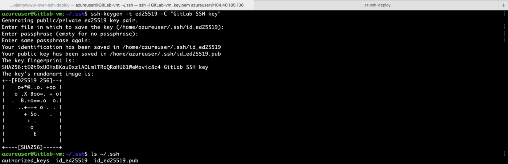
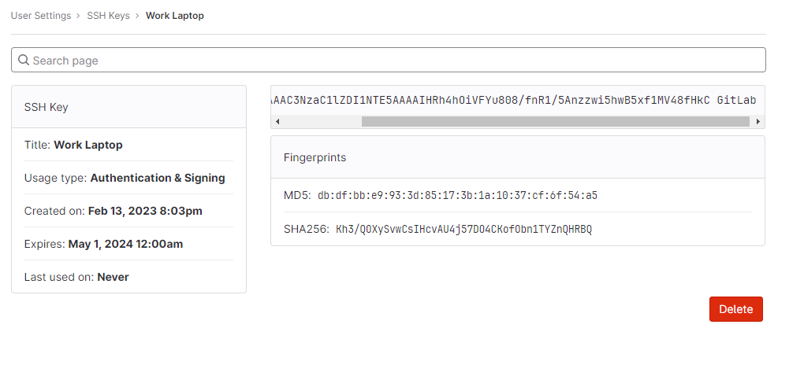

# Lab: Using SSH keys with GitLab private repositories

This lab is going to teach you a little bit about how Git works. It
walks you through the steps of creating your own project, editing a
file, and committing changes to a Git repository from the command line.

When you're done, you'll have a project where you can practice using
Git.

## What you need

Before you begin:

- Install Git on your local machine.
- Ensure you can sign in to an instance of GitLab. If your organization doesn’t have GitLab, create an account on `https://gitlab.com/`.
- Create SSH keys and add them to GitLab. SSH keys are how you securely communicate between your computer and GitLab.

## Create SSH key

SSH uses two keys, a public key and a private key.

- The public key can be distributed.
- The private key should be protected.

When you need to copy or upload your SSH public key, make sure you do not accidentally copy or upload your private key instead.

Let's create new ssh key using the VM. GitLab recommendation
is to create SSH key type ED25519, which is more secure than RSA. 

**Generate an SSH key pair**

If you do not have an existing SSH key pair, generate a new one:

1. Open a terminal.
2. Run `ssh-keygen -t` followed by the key type and an optional comment. This comment is included in the .pub file that’s created. You may want to use an email address for the comment. To create new key run following command. Text after `-C` option is a comment and you can change it.

    `ssh-keygen -t ed25519 -C "GitLab SSH key"`

3. Press `Enter`. Output similar to the following is displayed:

    ```
    Generating public/private ed25519 key pair.
    Enter file in which to save the key (~/.ssh/id_ed25519):
    ```

4. Accept the suggested filename and directory.

5. Do not specify a passphrase:

    ```
    Enter passphrase (empty for no passphrase):
    Enter same passphrase again:
    ```

A confirmation is displayed, including information about where your files are stored.



The key will be created in default directory which for linux is
`~/.ssh`. You should have two new files in `.ssh` directory:

-   `id_ed25519` --- private key
-   `id_ed25519.pub` --- public key


**Add an SSH key to your GitLab account**

To use SSH with GitLab, copy your public key to your GitLab account:

1. Copy the contents of your public key file.

```
cat ~/.ssh/id_ed25519.pub
```

2. Sign in to GitLab.
3. On the top bar, in the upper-right corner, select your avatar.
4. Select **Preferences**.
5. On the left sidebar, select SSH Keys.
6. In the Key box, paste the contents of your public key. If you manually copied the key, make sure you copy the entire key, which starts with `ssh-ed25519` and may end with a comment.
7. In the **Title** box, type a description, like `Work Laptop` or `Home Workstation`.
8. Optional. Select the **Usage type** of the key. It can be used either for Authentication or Signing or both. Authentication & Signing is the default value.
9. Optional. **Update Expiration** date to modify the default expiration date. 
10. Select **Add key**.


**Verify that you can connect**

Verify that your SSH key was added correctly.

Open a terminal and run this command, replacing gitlab.com with your GitLab instance URL:

`ssh -T git@gitlab.com`

If this is the first time you connect, you should verify the authenticity of the GitLab host. If you see a message like:

```
The authenticity of host 'gitlab.com (35.231.145.151)' can't be established.
ECDSA key fingerprint is SHA256:HbW3g8zUjNSksFbqTiUWPWg2Bq1x8xdGUrliXFzSnUw.
Are you sure you want to continue connecting (yes/no)? yes
Warning: Permanently added 'gitlab.com' (ECDSA) to the list of known hosts.
```

Type yes and press `Enter`.

Run the `ssh -T git@gitlab.com` command again. You should receive a Welcome to GitLab, @username! message.


**View your account’s SSH keys**

1. Sign in to GitLab.
2. On the top bar, in the upper-right corner, select your avatar.
3. Select Preferences.
4. On the left sidebar, select SSH Keys.
Your existing SSH keys are listed at the bottom of the page. The information includes:

- The key’s:
    * Name.
    * Public fingerprint.
    * Expiry date.
    * Permitted usage types.



## Steps

Here's an overview of what we're going to do:

1. Create a sample project.
2. Clone the repository.
3. Create a branch and make your changes.
4. Commit and push your changes.
5. Merge your changes.
6. View your changes in GitLab.


### Create a sample project

To start, create a sample project in GitLab.

1.  In GitLab, on the top bar, select **Main menu \> Projects \> View
    all projects**.
2.  On the right of the page, select **New project** > `Create blank project`.

    

3.  For **Project name**, enter `My sample project`.
    The project slug is generated for you. This slug is the URL you can
    use to access the project after it's created.
4.  Ensure **Initialize repository with a README** is selected. How you
    complete the other fields is up to you.
5.  Select **Create project**.

### Clone the repository

Now you can clone the repository in your project. *Cloning* a repository
means you're creating a copy on your computer, or wherever you want to
store and work with the files.

1.  On your project page, select **Clone**. Copy the URL for **Clone
    with SSH**.

    [](./images/clone_project_v14_9.png)

2.  Open a terminal on your computer and go to the directory where you
    want to clone the files.

3.  Enter `git clone` and paste the URL:

    ``` 
    git clone git@gitlab.com:YOUR_GITLAB_USERNAME/my-sample-project.git
    ```
    
    

4.  Go to the directory:

    ``` 
    cd my-sample-project
    ```
    
    

5.  By default, you've cloned the default branch for the repository.
    Usually this branch is `main`. To be sure, get
    the name of the default branch:

    ``` 
    git branch
    ```
    
    

    The branch you're on is marked with an asterisk. Press
    `Q` on your keyboard to return to the main
    terminal window.

### Create a branch and make changes

Now that you have a copy of the repository, create your own branch so
you can work on your changes independently.

1.  Create a new branch called
    `example-tutorial-branch`.

    ``` 
    git checkout -b example-tutorial-branch
    ```
    
    

2.  In a text editor like Visual Studio Code, Sublime,
    `nano`, or any other editor, open the README.md
    file and add this text:

    
    
    ```
    Hello world! I'm using Git!
    ```
    
    

3.  Save the file.

4.  Git keeps track of changed files. To confirm which files have
    changed, get the status.

    ``` 
    git status
    ```
    
    

    You should get output similar to the following:

    ``` 
    On branch example-tutorial-branch
    Changes not staged for commit:
    (use "git add <file>..." to update what will be committed)
    (use "git restore <file>..." to discard changes in working directory)
    modified:   README.md

    no changes added to commit (use "git add" and/or "git commit -a")
    ```
    
    

### Commit and push your changes

You've made changes to a file in your repository. Now it's time to
record those changes by making your first commit.

1.  Add the `README.md` file to the *staging* area.
    The staging area is where you put files before you commit them.

    ``` 
    git add README.md
    ```
    
    

2.  Confirm the file is staged:

    ``` 
    git status
    ```
    
    

    You should get output similar to the following, and the filename
    should be in green text.

    ``` 
    On branch example-tutorial-branch
    Changes to be committed:
    (use "git restore --staged <file>..." to unstage)
    modified:   README.md
    ```
    
    

3.  Now commit the staged file, and include a message that describes the
    change you made. Make sure you surround the message in double quotes
    (").

    ``` 
    git commit -m "I added text to the README file"
    ```
    
    

4.  The change has been committed to your branch, but your branch and
    its commits are still only available on your computer. No one else
    has access to them yet. Push your branch to GitLab:

    ``` 
    git push origin example-tutorial-branch
    ```
    
    

Your branch is now available on GitLab and visible to other users in
your project.

[](./images/branches_dropdown_v14_10.png)

### Merge your changes

Now you're ready to merge the changes from your
`example-tutorial-branch` branch to the default
branch (`main`).

1.  Check out the default branch for your repository.

    ``` 
    git checkout main
    ```
    
    

2.  Merge your branch into the default branch.

    ``` 
    git merge example-tutorial-branch
    ```
    
    

3.  Push the changes.

    ``` 
    git push
    ```
    

For this lab, you merge your branch directly to the default branch
for your repository. In GitLab, you typically use a `merge request` to merge your branch which will be created in upcoming lab.


### View your changes in GitLab

You did it! You updated the `README.md` file in your
branch, and you merged those changes into the `main`
branch.

Let's look in the UI and confirm your changes. Go to your project.

-   Scroll down and view the contents of the
    `README.md` file. Your changes should be
    visible.

-   Above the `README.md` file, view the text in the
    **Last commit** column. Your commit message is displayed in this
    column:

    [](./images/commit_message_v14_10.png)

Now you can return to the command line and change back to your personal
branch (`git checkout example-tutorial-branch`). You
can continue updating files or creating new ones. Type
`git status` to view the status of your changes and
commit with abandon.

