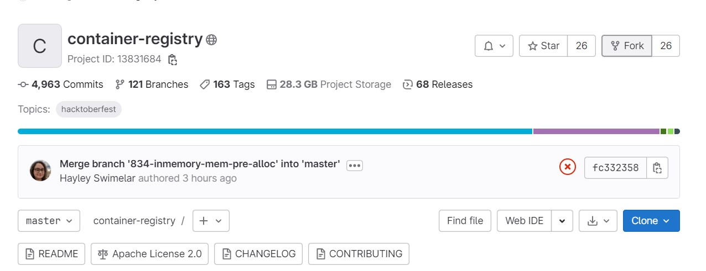
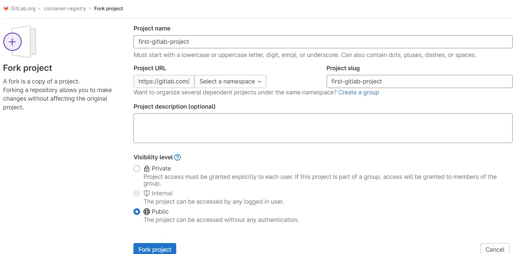
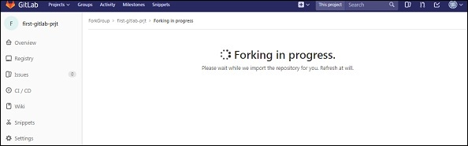
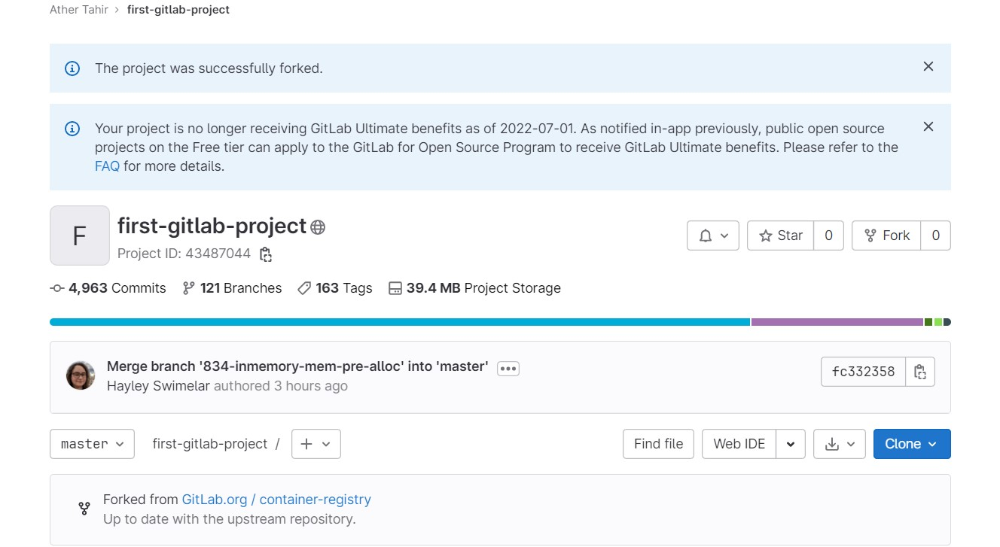
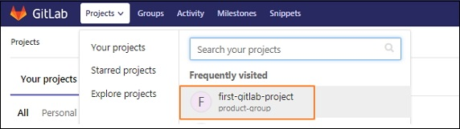
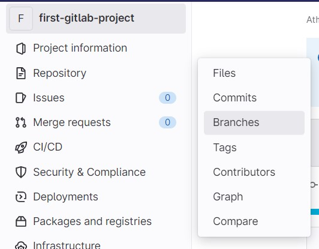
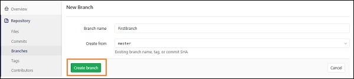
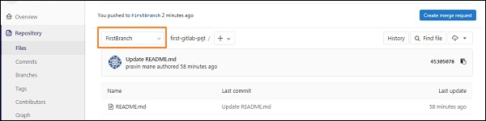
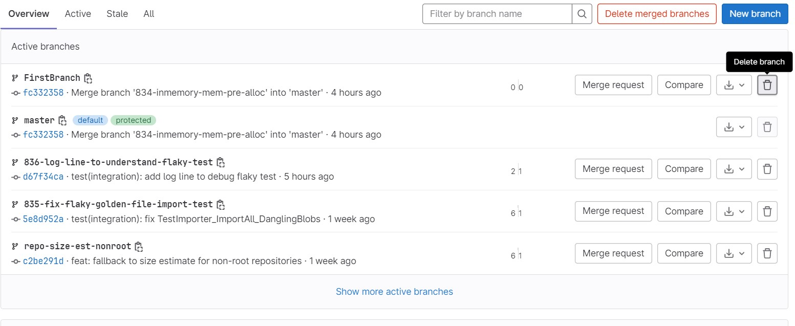
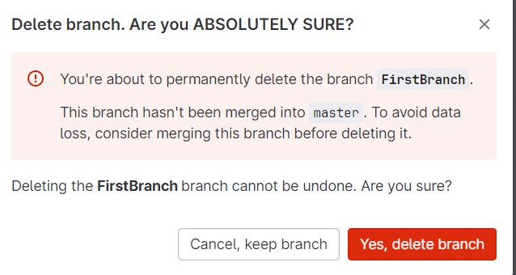

Lab : Gitlab Branches
----------------------

Fork is a duplicate of your original repository in which you can make
the changes without affecting the original project.

#### Forking a Project

**Step 1** − To fork a project, Open following URL after login in your gitlab account and click on the *Fork* button as shown
below −

`https://gitlab.com/gitlab-org/container-registry`

**Step 2** − After clicking the `Fork` button the project, enter project name as shown below:

**Step 3** − Next it will start processing of forking a project for
sometime as shown below −

**Step 4** − It will display the success message after completion of
forking the project process −

### GitLab - Create a Branch

Branch is independent line and part of the development process. The
creation of branch involves following steps.

#### Creating a Branch

**Step 1** − Login to your GitLab account and go to your project under
*Projects* section.

**Step 2** − To create a branch, click on the *Branches* option under
the *Repository* section and click on the *New branch* button.

**Step 3** − In the *New branch* screen, enter the name for branch and
click on the *Create branch* button.

**Step 4** − After creating branch, you will get a below screen along
with the created branch.

### GitLab - Delete a Branch

**Step 1** − To create a branch, click on the *Branches* option under
the *Repository* section and click on the *Delete* button next to branch name.

**Step 2** − Confirm to delete branch as shown below:

