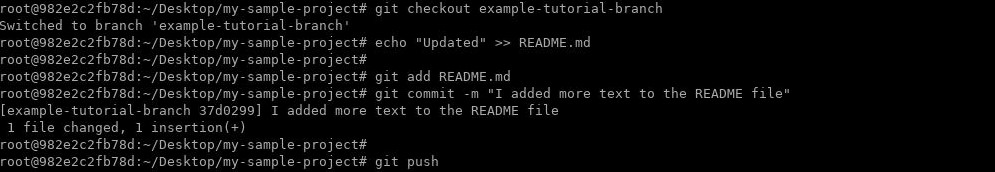
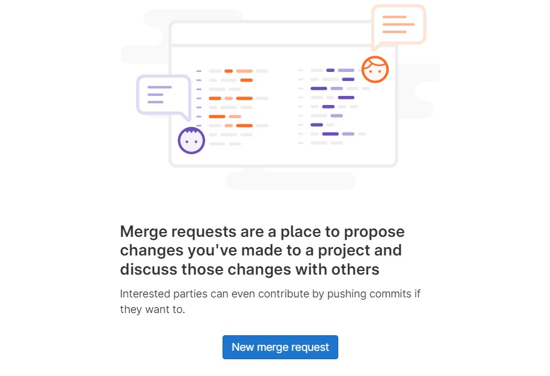
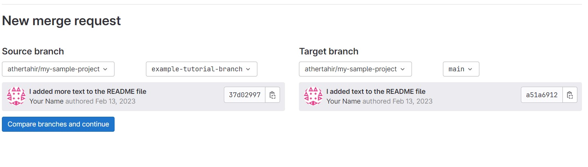
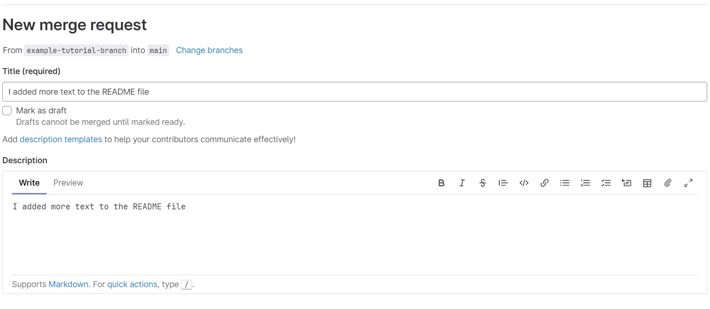
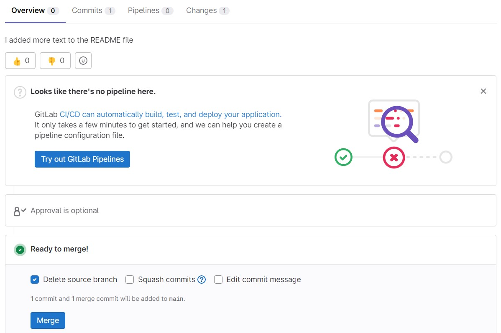
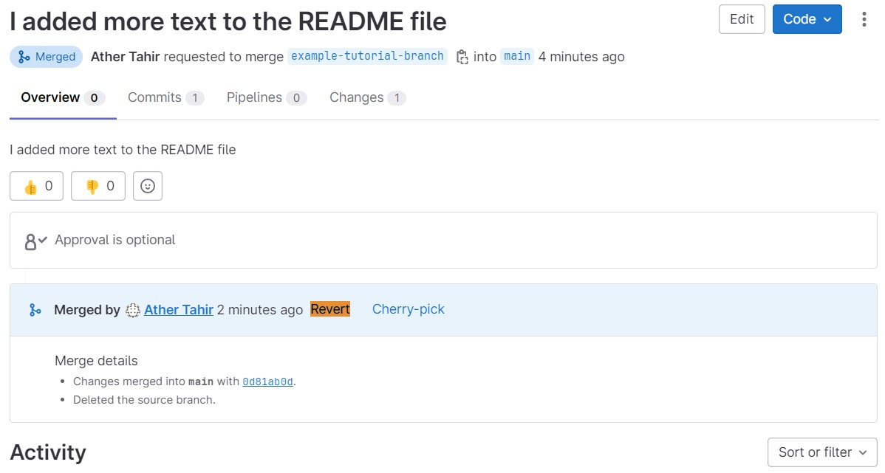
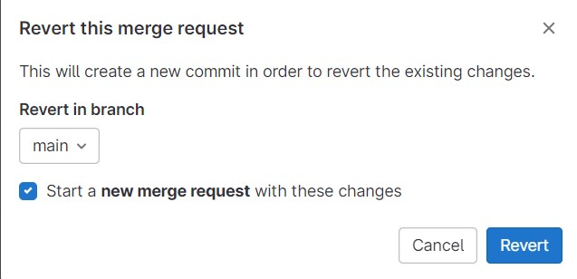

# Managing Merge Requests

There are many different ways to create a merge request.


### Task: Make changes in Gitlab Repo

1. Switch to `example-tutorial-branch` in terminal of repo created in lab 3.
2.  Make changes in `README.md` and push the changes.

    

## From the merge request list

You can create a merge request from the list of merge requests.

1.  On the top bar, select **Main menu \> Projects** and find your
    project.
2.  On the left menu, select **Merge requests**.
3.  In the upper right, select **New merge request**.

    

4.  Select a source and target branch and then **Compare branches and continue**.

    

5.  Fill out the fields and select **Create merge request**.

    

Merge requests are designed around a one-to-one (1:1) branch
relationship. Only one open merge request may be associated with a given
target branch at a time.

6. You can merge the **merge request** as shown below:

    


### Revert a merge request

You can revert an entire merge request in GitLab.
When you revert a commit in Git, you create a new commit that reverses
all actions taken in the original commit:


After a merge request is merged, you can revert all changes in the merge
request.

**Prerequisites:**

-   You must have a role in the project that allows you to edit merge
    requests, and add code to the repository.
-   Your project must use the [merge method]
    **Merge Commit**, which is set in the project's **Settings \>
    General \> Merge request**. You can't revert fast-forwarded commits
    from the GitLab UI.

To do this:

1.  On the top bar, select **Main menu \> Projects** and find your
    project.
2.  On the left sidebar, select **Merge requests** and identify your
    merge request.
3.  Scroll to the merge request reports area, and find the report
    showing when the merge request was merged.
4.  Select **Revert**.

    

5.  In **Revert in branch**, select the branch to revert your changes
    into.
6.  Optional. Select **Start a new merge request** to start a new merge
    request with the new revert commit.
7.  Select **Revert**.

    

The option to **Revert** is no longer shown after a merge request is
reverted.


## Task Create Merge Request: When you add, edit, or upload a file

You can create a merge request when you add, edit, or upload a file to a
repository.

1.  [Add, edit, or upload] a file to the repository.
2.  In the **Commit message**, enter a reason for the commit.
3.  Select the **Target branch** or create a new branch by typing the
    name (without spaces, capital letters, or special chars).
4.  Select the **Start a new merge request with these changes** checkbox
    or toggle. This checkbox or toggle is visible only if the target is
    not the same as the source branch, or if the source branch is
    protected.
5.  Select **Commit changes**.

## Task Create Merge Request: When you create a branch

You can create a merge request when you create a branch.

1.  On the top bar, select **Main menu \> Projects** and find your
    project.
2.  On the left menu, select **Repository \> Branches**.
3.  Type a branch name and select **New branch**.
4.  Above the file list, on the right side, select **Create merge
    request**. A merge request is created. The default branch is the
    target.
5.  Fill out the fields and select **Create merge request**.

## Task Create Merge Request: When you use Git commands locally

You can create a merge request by running Git commands on your local
machine.

1.  Create a branch:

    ``` 
    git checkout -b my-new-branch
    ```
    
    

2.  Create, edit, or delete files. The stage and commit them:

    ``` 
    git add .
    git commit -m "My commit message"
    ```
    
    

3.  Push your branch to GitLab:

    ``` 
    git push origin my-new-branch
    ```
    
    

    GitLab prompts you with a direct link for creating a merge request:

    
    
    ```
    ...
    remote: To create a merge request for my-new-branch, visit:
    remote:   https://gitlab.com/YOUR_USERNAME/my-project/merge_requests/new?merge_request%5Bsource_branch%5D=my-new-branch
    ```
    
    
4.  Copy the link and paste it in your browser.

