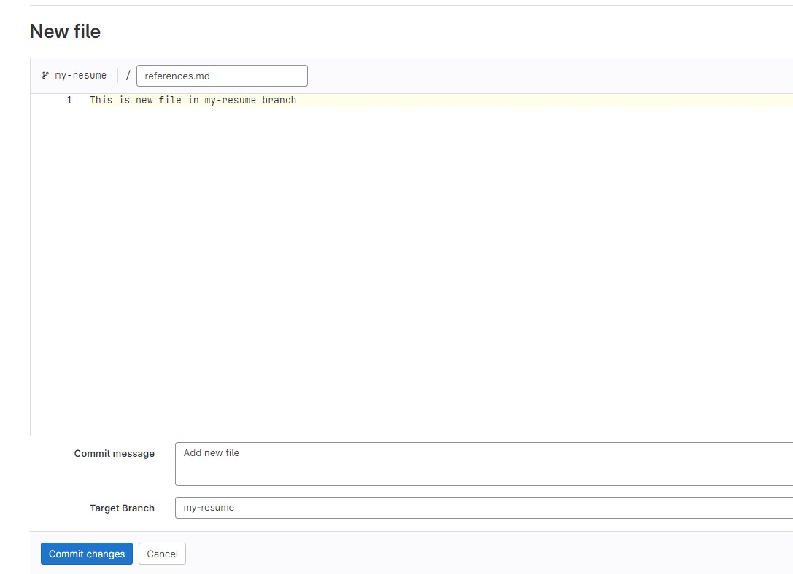
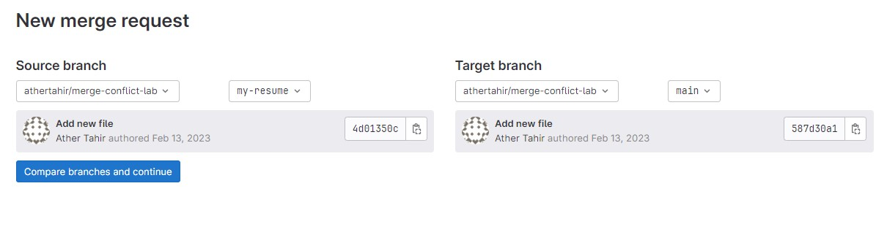
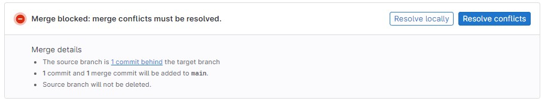
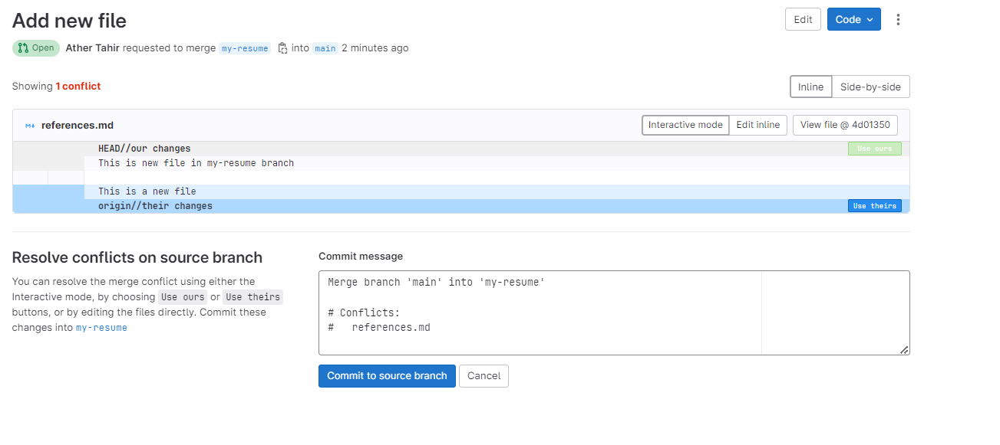
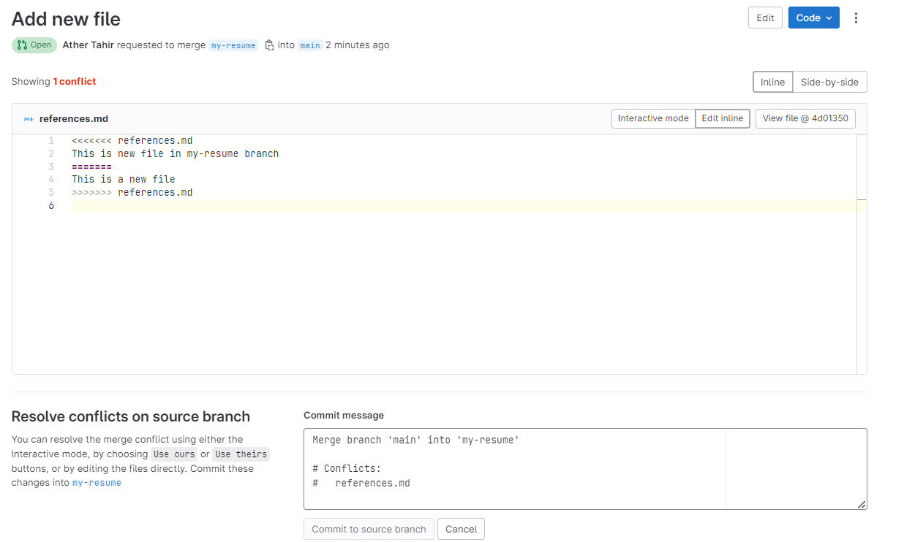
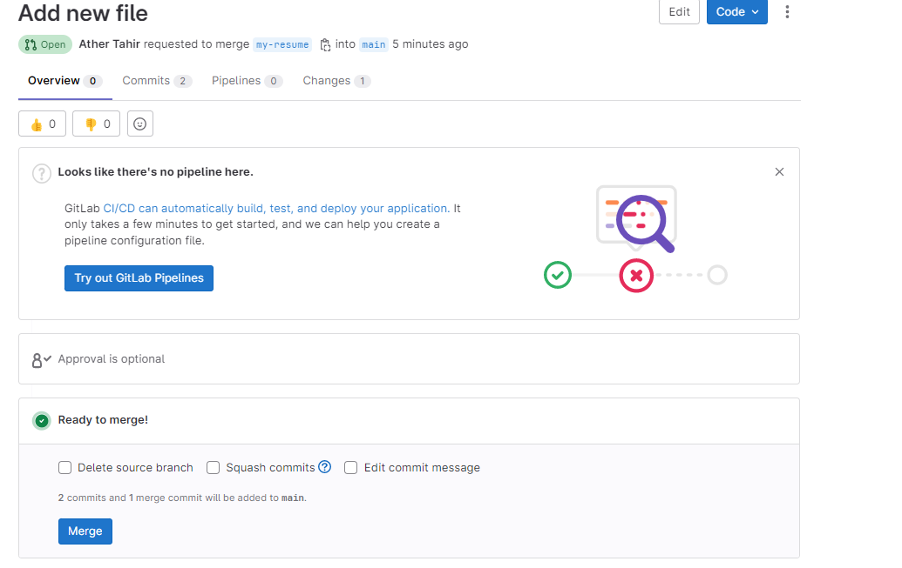

### Lab: Managing Merge Conflicts

*Merge conflicts* happen when the two branches in a merge request (the
source and target) each have different changes, and you must decide
which change to accept. In a merge request, Git compares the two
versions of the files line by line. In most cases, GitLab can merge
changes together. However, if two branches both change the same lines,
GitLab blocks the merge, and you must choose which change you want to
keep.

## Conflicts you can resolve in the user interface

If your merge conflict meets all of the following conditions, you can
resolve the merge conflict in the GitLab user interface:

-   The file is text, not binary.
-   The file is in a UTF-8 compatible encoding.
-   The file does not already contain conflict markers.
-   The file, with conflict markers added, is less than 200 KB in size.
-   The file exists under the same path in both branches.

If any file in your merge request contains conflicts, but can't meet all
of these criteria, you must resolve the conflict manually.

**Note:** Create blank new repository `merge-conflict-lab` before starting this lab.

### Activity: Create your own conflict

1. Create new branch `my-resume` from `main` branch.
   

2. Select `main` branch and create a new file called `references.md`, add some text and push that change to `main`, without updating your `my-resume` branch.
   

3. Browse to the `my-resume` branch.
4. Click the dropdown menu and then on `New file`.
5. Create a file named `references.md`.
6. Enter some text that conflicts with what we added for `references.md` in the `main` branch.
   

7. Scroll to the bottom of the page and enter a commit message for your change.
8. Click the **Commit Changes** button.

### Activity: Create Merge Request

1.  On the top bar, select **Main menu \> Projects** and find your
    project.

2.  On the left sidebar, select **Merge requests** and create the merge
    request.
   


### Methods of resolving conflicts

GitLab shows conflicts available for resolution
in the user interface, and you can also resolve conflicts locally
through the command line:

- `Interactive mode`: UI method best for conflicts that only require you to select which
    version of a line to keep, without edits.
- `Inline editor`: UI method best for more complex conflicts that require you to edit
    lines and manually blend changes together.
- `Command line`: provides complete control over the most complex conflicts.

### Resolve conflicts in interactive mode

To resolve less-complex conflicts from the GitLab user interface:

1.  On the top bar, select **Main menu \> Projects** and find your
    project.

2.  On the left sidebar, select **Merge requests** and find the merge
    request.

3.  Select **Overview**, and scroll to the merge request reports
    section.

4.  Find the merge conflicts message, and select **Resolve conflicts**.
    GitLab shows a list of files with merge conflicts. The conflicts are
    highlighted:
    

    

5.  For each conflict, select **Use ours** or **Use theirs** to mark the
    version of the conflicted lines you want to keep. This decision is
    known as "resolving the conflict."

6.  Enter a **Commit message**.

7.  **Note:** You can select **Commit to source branch** to resolve conflict but let's explore another option in the next step first.


## Resolve conflicts in the inline editor

Some merge conflicts are more complex, requiring you to manually modify
lines to resolve their conflicts. Use the merge conflict resolution
editor to resolve complex conflicts in the GitLab interface:

1.  On the top bar, select **Main menu \> Projects** and find your
    project.
2.  On the left sidebar, select **Merge requests** and find the merge
    request.
3.  Select **Overview**, and scroll to the merge request reports
    section.
4.  Find the merge conflicts message, and select **Resolve conflicts**.
    GitLab shows a list of files with merge conflicts.
5.  Select **Edit inline** to open the editor: 
    

6.  After you resolve the conflict, enter a **Commit message**.
7.  Select **Commit to source branch**.
8. After resolving the conflict(s), `Merge Request` is ready for merge:
    


Resolve Merge Conflict Locally
===============================

In this section, we will work on resolving merge conflicts.


**Creating a merge conflict**

Here, we will show you a simulation of how merge conflicts appear.


``` 
cd ~/Desktop
mkdir test-dir
cd test-dir
git init .
echo "some content" > example.txt
git add example.txt
git commit -am "initial commit"

[master (root-commit) a45c22d] initial commit
1 file changed, 1 insertion(+)
create mode 100524 example.txt
```


In the given example, we create a **test-dir** new directory. Next, we
create **example.txt** text file with some content and add it to the
repository and commit it. As a result, we have a new repository with one
master branch and **example.txt** file. The next step is creating
another branch to use as a conflicting merge.


``` 
git checkout -b branch_to_merge
echo "completely different content to merge later" > example.txt
git commit -am "edit the content of example.txt to make a conflict"

[branch_to_merge 4221135] edit the content of example.txt to make a conflict
1 file changed, 1 insertion(+), 1 deletion(-)
```


In the above example, we create and check out **branch\_to\_merge**
branch. After creating, we overwrite the content in **example.txt** file
and commit the new content. After doing all this, the commit overrides
the content of **example.txt:**


``` 
git checkout master
Switched to branch 'master'
echo "content to add" >> example.txt
git commit -am "added content to example.txt"
[master 11ab34b] added content to example.txt
1 file changed, 1 insertion(+)
```


This bunch of commands checks out the master branch attaching the
content to **example.txt** and committing it. So, our repository is put
to the state where we have one commit in the master branch and one in
the **branch\_to\_merge** branch. The final step is to execute the [git
merge]{.kbd .highlighted} command after which conflict will occur:


``` 
git merge branch_to_merge
Auto-merging example.txt
CONFLICT (content): Merge conflict in example.txt
Automatic merge failed; fix conflicts and then commit the result.
```


Identifying merge conflicts
---------------------------

As we have already seen, Git displays output which indicates that a
conflict has appeared. Execute the `git status` command to see
the unmerged paths:


``` 
git status
On branch master
You have unmerged paths.
(fix conflicts and run "git commit")
(use "git merge --abort" to abort the merge)
Unmerged paths:
(use "git add <file>..." to mark resolution)
both modified:   example.txt
```


The example.txt file appears in a modified state. Execute **cat**
command to put out the contents of the example.txt file. We can see
these visual marks:


``` 
<<<<<<< HEAD
=======
>>>>>>> branch_to_merge
```


The **=======** marks is the center of the conflict. The content between
the center and the HEAD line is the content existing in the current
branch master that the HEAD reference is pointing to. Read more about
visual marks on the [git merge]{.kbd .highlighted} page.

Resolving merge conflicts
-------------------------

To resolve a merge conflict you should edit the conflicted file. Open
the **example.txt** file in the editor and remove all the marks. The
changed file has the following look:


``` 
some content to mess with
content to add
completely different content to merge later
```


Execute the `git add`
command to stage the new merge content. Next, create a new commit to
complete the merge:


``` 
git add .
git commit -m "the conflict in example.txt is merged and resolved"
```
