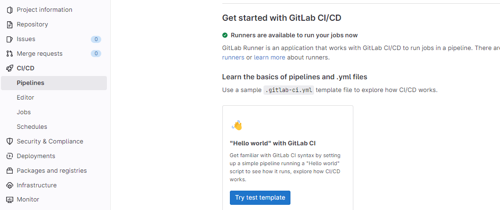

# GitLab CI Pipeline. Build docker image in pipeline job.

Gitlab allows seamlessly using docker image from public and private
hubs. I bet that most of you uses docker executors. All works great and
without a hassle until you need to build your own docker image.
Fortunately, you can build your docker image automatically in pipeline
by leveraging docker-in-docker image build.
I'll show you how to include docker image build in Gitlab CI Pipeline,
push it to Gitlab Repo and use it in another job.

# Prerequisite

-   Gitlab account
-   Docker basic knowledge

# Agenda

1.  Create Gitlab blank project
2.  Create Dockerfile
3.  Create Gitlab CI pipeline (.gitlab-ci.yml)
    1.  Build and push docker image
    2.  Use custom docker image
    3.  Be efficient!
4.  Summary

# Create new GitLab project

Create new blank project which we will use
throughout this lab. Login into GitLab and navigate to
`New project -> Create blank project/repository`. Give it a project name and hit
`Create project`.


Clone the project and we are ready to go.

# Create Dockerfile

We need to create a Dockerfile, which will be used to build an docker
image. Let's use `Alpine Linux`
as base image. It is a minimal linux distribution \~5MB. Alpine Linux is
great choice when you have specific task to accomplish and you want to
use less storage, have fast build times.

Alpine doesn't have java installed by default - command
`java -version` would fail. We
will create Dockerfile to create new docker image based on Alpine with
`openjdk11` installation. After
building and pushing image to repo, we will use it in another job and
run command `java -version`
which should run successfully.

Creating new image is not the only option. You can use base Alpine image
in your pipeline job, then in `script` section of the job install java with regular linux
command. It will also work. Just keep in mind that that our example is
simple. Real world scenario could include multiple software installation
and configuration. You wouldn't want to run it every time pipeline is
trigged. Time is precious in CI/CD pipeline. It's more efficient to
build image at first and rebuild it only if Docker file changes.

```
FROM alpine:3

RUN apk add openjdk11

CMD ["/bin/sh"]
```

Our Dockerfile couldn't be more simple:

-   `FROM alpine:3` - use Alpine
    image with tag 3 as base image
-   `RUN apk add openjdk11` -
    run command to install openjdk11
-   `CMD ["/bin/sh"]` -
    specifies what command to run in container

Dockerfile is ready. Push it to Gitlab repo or create Dockerfile
directly in Gitlab.

# Create Gitlab CI pipeline (.gitlab-ci.yml) 

We will now create Gitlab CI pipeline and there are two options we could
use:

1.  Create a `.gitlab-ci.yml`
    file in the root of the repository
2.  Use Gitlab CI/CD editor (in Gitlab,
    `CI/CD -> Editor`)

Option 1 is probably used more often, especially in project using a git
branch strategy.
Option 2 is more than enough for our scenario.




Click on `Try test template`.
You will directed to editor with an example pipeline. We can use it, but
we only need `stage` section
including `build` and
`test` stages. Remove the rest
of the pipline and we can start creating jobs.

## Build and push docker image

Pipeline job for building docker image must have 3 main actions:

-   login into container registry
-   build docker image
-   push image to the docker registry

```
stages:       
  - build
  - test

build:docker-alpine-java:
  image: docker:20
  stage: build
  services: 
    - docker:20-dind
  variables:
    TAG: "$CI_REGISTRY_IMAGE/docker-alpine-java"
  before_script:
    - docker login -u $CI_REGISTRY_USER -p $CI_REGISTRY_PASSWORD $CI_REGISTRY
  script:
    - docker pull $TAG:latest || true
    - docker build --cache-from $TAG:latest --tag $TAG:$CI_COMMIT_REF_NAME --tag $TAG:latest .
    - docker push $TAG:$CI_COMMIT_REF_NAME
    - docker push $TAG:latest
```

Currently our pipeline has job for building docker image. Let's explain
it:

-   `build:docker-alpine-java` -
    A job's name
-   `stage` - Stage in which job
    runs.
-   `image` - An image which
    will be used to create container for running our script
-   `services` - Defines docker
    image that runs during the job linked to the docker image specified
    in `image`. We are using
    docker-in-docker (job is running docker as image and as service)
-   `variables` - Defines
    variables for the job. We only define one variable, image name.
-   `before_script` - Defines
    commands to be run before commands in `script` section. We use it to login into Gitlab
    container registry. The variables used are predefined Gitlab
    variables.
-   `script` - Defines the main
    commands to be run during job. There are 3 main steps in the script:
    -   `docker pull $TAG:latest || true` 
        Pulls image with latest tag or returns
        `true`. It will ensure
        that job will not fail if there is no image with latest tag.
    -   `docker build --cache-from $TAG:latest --tag $TAG:$CI_COMMIT_REF_NAME --tag $TAG:latest .` 
        Builds image using Dockerfile in repo root directory and tags it
        twice (branch name and latest). Uses option
        `--cache-from` to use
        cache from latest avaiable image in container registry. Since we
        are running docker-in-docker, each time in fresh environment,
        current runtime has no data from previous runs. The docker
        runtime can't use cache from previous build, unlesss we manually
        pull latest image and supply it in
        `--cache-from` option.
    -   `docker push $TAG:$CI_COMMIT_REF_NAME`
        Push image tagged with branch name to container repository.
    -   `docker push $TAG:latest` 
        Push image tagged with latest to container repository.
        
        Hit button `Commit changes`  below editor and the pipeline should start
        automatically. Go to `CI/CD -> Pipelines` .


First pipeline run for docker image build

You can click on `Status` to
check the logs and more detailed information. Pipeline run succesfully.
Let's check the container registry. Go to
`Packages & Registry -> Container Registry`.


You should see an image with a name the same as defiend in
`$TAG` variable inside pipeline
job. Under the name there is information that two tagged image exist.
Click on image name.


Two images exist as expected: one tagged latest and second tagged with
branch name (main in mine case).

## Use custom docker image

Docker image build is working now as expected and is part of the
pipeline. Now we will use newly created image in another pipeline job.
Second job will use `docker-alpine-java` image and run script
`java -version` to see that in
fact we are using our custom alpine image with java installed.

```
stages:       
  - build
  - test

build:docker-alpine-java:
  image: docker:20
  stage: build
  services: 
    - docker:20-dind
  variables:
    TAG: "$CI_REGISTRY_IMAGE/docker-alpine-java"
  before_script:
    - docker login -u $CI_REGISTRY_USER -p $CI_REGISTRY_PASSWORD $CI_REGISTRY
  script:
    - docker pull $TAG:latest || true
    - docker build --cache-from $TAG:latest --tag $TAG:$CI_COMMIT_REF_NAME --tag $TAG:latest .
    - docker push $TAG:$CI_COMMIT_REF_NAME
    - docker push $TAG:latest

test:alpine-java:
  image: $CI_REGISTRY_IMAGE/docker-alpine-java:latest
  stage: test
  script:
    - java -version
```

Testing custom image job is quite simpler.

-   `test:alpine-java` - Job
    name.
-   `image` - Image used by job.
    It's path to our custom image in Gitlab container registry
-   `stage` - Stage in which job
    runs.
-   `script` - Defines the main
    commands to be run during job. Java version check in our case.

Go to the `CI/CD -> Pipelines`,
then click on last one to see that two jobs were done succesfully (build
and test). Click on test job to check the logs. / We are looking for two
interesting parts:

-   logs showing which image is being used 

-   logs showing `java -version`
    command 

## Be efficient!

You might have noticed a flaw in pipeline. When pipeline run at first it
had built alpine-java image and pushed it to repository. When pipeline
has run the second time it built alpine-image again, even though it was
not necessary. It's casued by not having any rules defining when to run
a job in piepline.
Fortunately it is a quick fix. Add a rule section in
`build:docker-alpine-java` job.
The rule will allow job to run only if there is any change in
`Dockerfile`.

```
stages:       
  - build
  - test

build:docker-alpine-java:
  image: docker:20
  stage: build
  services: 
    - docker:20-dind
  variables:
    TAG: "$CI_REGISTRY_IMAGE/docker-alpine-java"
  before_script:
    - docker login -u $CI_REGISTRY_USER -p $CI_REGISTRY_PASSWORD $CI_REGISTRY
  script:
    - docker pull $TAG:latest || true
    - docker build --cache-from $TAG:latest --tag $TAG:$CI_COMMIT_REF_NAME --tag $TAG:latest .
    - docker push $TAG:$CI_COMMIT_REF_NAME
    - docker push $TAG:latest
  rules:
    - changes:
      - Dockerfile

test:alpine-java:
  image: $CI_REGISTRY_IMAGE/docker-alpine-java:latest
  stage: test
  script:
    - java -version
```

If you now check latest pipeline run you will notice that only
`test:alpine-java` was run in
pipeline. 


Moreover, thanks to the flaw we have just fixed, you can compare
diffrence in duration of two docker build jobs.


Maybe you already figured why the build job took 1 min 30 sec when was
run first time, but only 1 min when run second time? The answer is
cache. Second run built exactly the same image as the first run,
beacause there was no diffrence in Dockerfile. Since we implemented
cache usage in docker image build job, the second run was much quicker.

# Summary

In this lab, we have succesfully:

-   Created Dockerfile
-   Implemented docker image build in Gitlab pipeline job
-   Used the newly created image in another job
